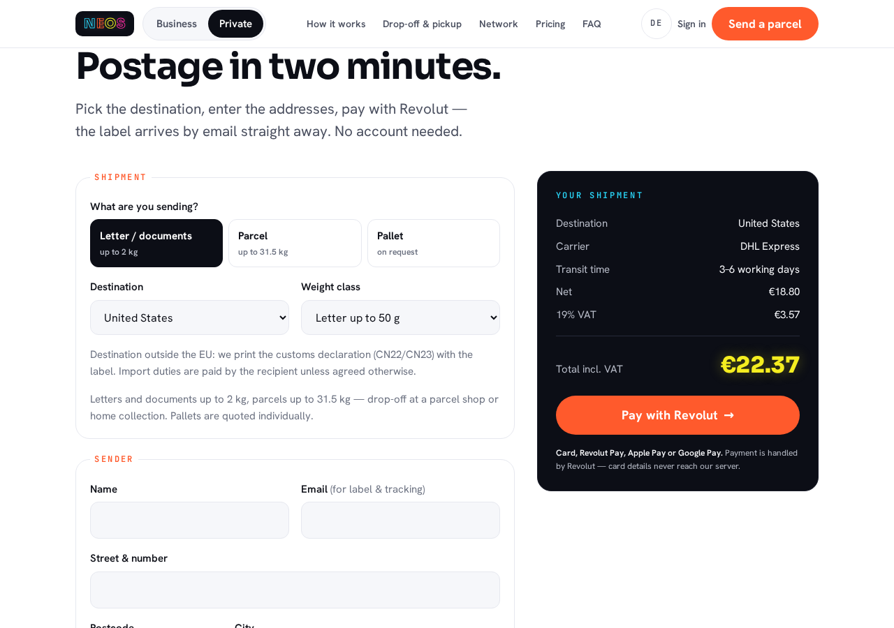
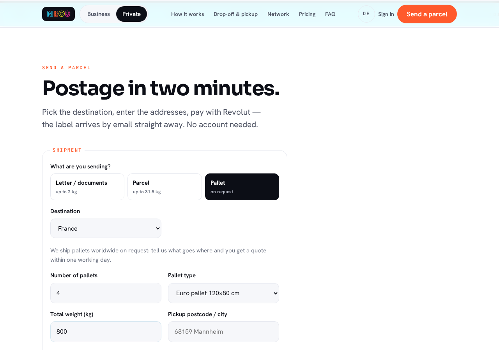
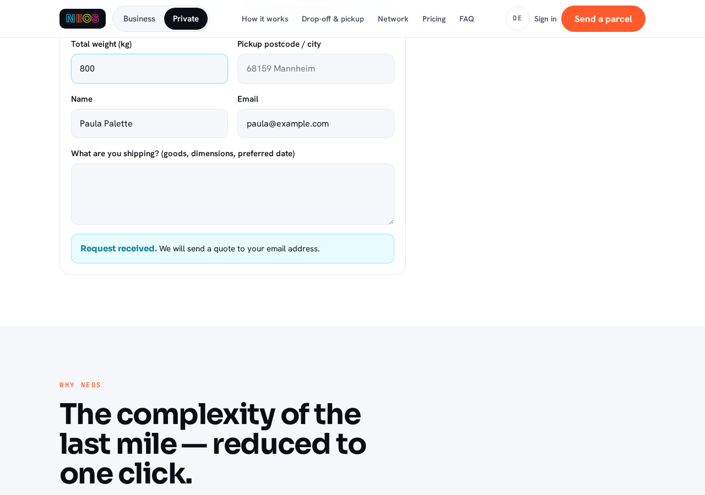
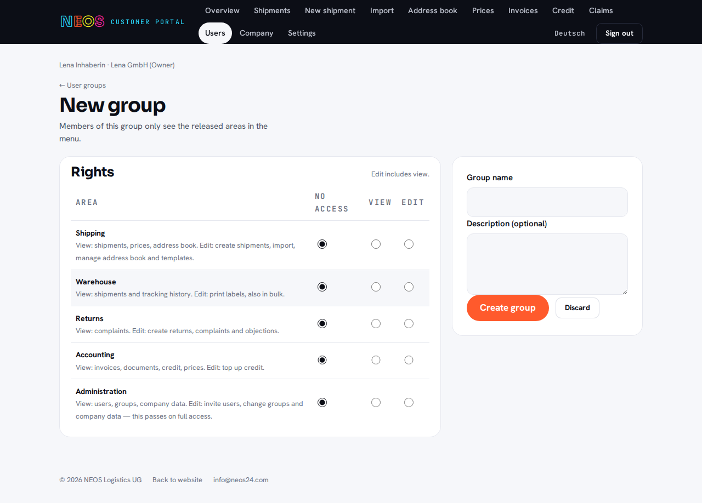

# NEOS24 Platform — Technical Overview

**For:** IT colleagues (development, operations) · **As of:** 14 September 2026 · **Source:** branch
`claude/neos24-rebranding-html-gfzvr8`, [Pull Request #38](https://github.com/kandziormannheim-dot/files/pull/38)

Every file reference in this document links to the current state in the repository
`kandziormannheim-dot/files` under `neos24/site/`. After the merge into `main`, replace
`blob/claude/neos24-rebranding-html-gfzvr8` with `blob/main` in the links. The German version sits
next to this file as [UEBERSICHT.md](https://github.com/kandziormannheim-dot/files/blob/claude/neos24-rebranding-html-gfzvr8/neos24/site/docs/UEBERSICHT.md).

## Contents

1. [Purpose and overview](#1-purpose-and-overview)
2. [Architecture](#2-architecture)
3. [Homepage (DE/EN)](#3-homepage-deen)
4. [Payment with Revolut](#4-payment-with-revolut)
5. [Customer portal `konto/`](#5-customer-portal-konto)
6. [Internal dashboard `intern/`](#6-internal-dashboard-intern)
7. [Integrations and links between systems](#7-integrations-and-links-between-systems)
8. [Data model](#8-data-model)
9. [Configuration](#9-configuration)
10. [Design](#10-design)
11. [Security](#11-security)
12. [Operations](#12-operations)
13. [Tests and acceptance](#13-tests-and-acceptance)
14. [References](#14-references)
15. [Appendix: screenshots](#15-appendix-screenshots)

---

# 1. Purpose and overview

NEOS24 is the shipping platform of NEOS Logistics: customers book shipments worldwide across
several carriers, pay online or on account, print labels, track shipments and manage their
documents. The NEOS team maintains prices, routing, customers and invoices in an internal
dashboard and checks the carriers' invoices automatically against its own bookings.

The platform consists of three user interfaces on one shared code base and one database:

| Interface | Path | Users | Purpose |
|---|---|---|---|
| **Homepage** | `/` (DE), `/en/` (EN) | public, private customers | marketing, price table, checkout for private customers with Revolut, contact form, pallet request |
| **Customer portal** | `/konto/` | private and business customers and their staff | create and pay shipments, labels, tracking, address book, import, returns, claims, credit balance, document archive, users and groups |
| **Dashboard** | `/intern/` | NEOS team | orders, prices and routing, customers and enquiries, invoices, claims, supplier invoice verification, statistics, synchronisation, users and roles |

**Technical stack** — deliberately without a framework and without a build chain:

- PHP 8.4, no Composer dependencies. The only bundled library is FPDF (vendored under
  [`lib/pdf/`](https://github.com/kandziormannheim-dot/files/blob/claude/neos24-rebranding-html-gfzvr8/neos24/site/lib/pdf/fpdf.php)) for label, invoice and weight-report PDFs.
- SQLite as the only database (`bestellungen.sqlite` in the data directory outside the web root).
- Static HTML/CSS/JS for the homepage; PHP views without a template engine for portal and dashboard.
- Own readers and writers for CSV, XLSX, PDF text, IMAP and Code 128 barcodes so that no external
  packages need maintaining.
- External services: Revolut Merchant API (payment), Lexware Office (invoices), Odoo (CRM/sales),
  an IMAP mailbox (carrier invoices). All four are optional and run through queues.

**Audiences:** The homepage has two variants, business (default) and private customers. Both
customer groups use the same portal; business customers additionally have a company, sub-accounts,
user groups, purchase on account, consolidated invoices and shipment import.

**Data flows at a glance**

```
Homepage ──(checkout)──▶ api/revolut/bestellung.php ──▶ Revolut ──(webhook)──▶ paid
    │                                                                        ├─▶ mail + label
    └──(contact, pallet)──▶ api/anfrage.php ──▶ dashboard "Customers & enquiries" └─▶ Lexware invoice
Portal ──▶ bestellungAnlegen() ──▶ ordered/paid ──▶ consolidated invoice ──▶ Lexware, Odoo
Dashboard ──▶ routing matrix ──▶ preisliste() ──▶ homepage, portal, checkout (live)
Carrier invoice (upload/IMAP) ──▶ invoice verification ──▶ surcharge + weight report PDF
Company, sub-account, customer ──▶ sync_auftraege ──▶ Lexware contact, Odoo partner ◀── reverse sync
```

---

# 2. Architecture

## 2.1 Directory structure

| Path | Content |
|---|---|
| [`index.html`](https://github.com/kandziormannheim-dot/files/blob/claude/neos24-rebranding-html-gfzvr8/neos24/site/index.html), [`en/index.html`](https://github.com/kandziormannheim-dot/files/blob/claude/neos24-rebranding-html-gfzvr8/neos24/site/en/index.html) | homepage German and English, same structure, `hreflang` both ways |
| [`assets/`](https://github.com/kandziormannheim-dot/files/tree/claude/neos24-rebranding-html-gfzvr8/neos24/site/assets) | `neos.css` (tokens, components), `neos.js` (tabs, menu, FAQ, form), `checkout.js` (checkout, price table), `fonts.css` + `fonts/` (Sora, Hanken Grotesk, JetBrains Mono as WOFF2) |
| [`api/revolut/`](https://github.com/kandziormannheim-dot/files/tree/claude/neos24-rebranding-html-gfzvr8/neos24/site/api/revolut) | `_bootstrap.php` (configuration, database, schema, price list, Revolut client, mail), `angebot.php`, `bestellung.php`, `status.php`, `webhook.php`, `webhook-einrichten.php`, `preise.php` (seed), `neos24-config.beispiel.php` |
| [`api/anfrage.php`](https://github.com/kandziormannheim-dot/files/blob/claude/neos24-rebranding-html-gfzvr8/neos24/site/api/anfrage.php) | contact form and pallet request of the homepage |
| [`api/lexware/webhook.php`](https://github.com/kandziormannheim-dot/files/blob/claude/neos24-rebranding-html-gfzvr8/neos24/site/api/lexware/webhook.php), [`api/odoo/webhook.php`](https://github.com/kandziormannheim-dot/files/blob/claude/neos24-rebranding-html-gfzvr8/neos24/site/api/odoo/webhook.php) | webhook receivers of the third-party systems |
| [`lib/`](https://github.com/kandziormannheim-dot/files/tree/claude/neos24-rebranding-html-gfzvr8/neos24/site/lib) | shared business logic for portal and dashboard (see 2.3) |
| [`konto/`](https://github.com/kandziormannheim-dot/files/tree/claude/neos24-rebranding-html-gfzvr8/neos24/site/konto) | customer portal: `index.php` (router), `src/` (bootstrap, auth, rights, routes, texts, views), `assets/` (CSS/JS) |
| [`intern/`](https://github.com/kandziormannheim-dot/files/tree/claude/neos24-rebranding-html-gfzvr8/neos24/site/intern) | dashboard: `index.php` (router), `src/` (bootstrap, auth, rights, KPIs, charts, statistics routes, views), `assets/`, `aufgaben.php` (cron), `einrichten.php` (first admin), `dev-router.php` (local) |
| [`screenshots/`](https://github.com/kandziormannheim-dot/files/tree/claude/neos24-rebranding-html-gfzvr8/neos24/site/screenshots) | Playwright captures of every page at 1280 and 375 px for acceptance |
| [`docs/`](https://github.com/kandziormannheim-dot/files/tree/claude/neos24-rebranding-html-gfzvr8/neos24/site/docs) | this document (DE/EN, Markdown and PDF) |

READMEs with details per area: [`README.md`](https://github.com/kandziormannheim-dot/files/blob/claude/neos24-rebranding-html-gfzvr8/neos24/site/README.md) (homepage),
[`api/revolut/README.md`](https://github.com/kandziormannheim-dot/files/blob/claude/neos24-rebranding-html-gfzvr8/neos24/site/api/revolut/README.md) (payment),
[`konto/README.md`](https://github.com/kandziormannheim-dot/files/blob/claude/neos24-rebranding-html-gfzvr8/neos24/site/konto/README.md) (portal),
[`intern/README.md`](https://github.com/kandziormannheim-dot/files/blob/claude/neos24-rebranding-html-gfzvr8/neos24/site/intern/README.md) (dashboard, invoice verification, Lexware, sync, statistics). All READMEs are written in German.

## 2.2 Request flow

- **Homepage:** static. `assets/checkout.js` fetches `api/revolut/angebot.php` on load (prices live
  from the database, cached 5 minutes) and rebuilds the checkout selection and the price table;
  without a backend the values in the markup remain.
- **Portal and dashboard:** one front controller each (`konto/index.php`, `intern/index.php`).
  Apache `mod_rewrite` routes everything to `index.php` via `.htaccess`; without rewrite,
  `index.php?pfad=/…` works. The router checks `$pfad` and `$methode` in order (`if ($pfad === …)`
  or `preg_match`); the portal's shipping routes live in
  [`konto/src/routen_versand.php`](https://github.com/kandziormannheim-dot/files/blob/claude/neos24-rebranding-html-gfzvr8/neos24/site/konto/src/routen_versand.php),
  the dashboard's statistics routes in
  [`intern/src/routen_statistik.php`](https://github.com/kandziormannheim-dot/files/blob/claude/neos24-rebranding-html-gfzvr8/neos24/site/intern/src/routen_statistik.php).
- **Views:** `ansicht('name', $daten)` extracts `$daten` and includes `src/views/name.php` inside
  `src/views/layout.php`. There is no template engine; output goes through `e()`.
- **Errors:** `fehlerSeite(403|404, …)` ends the request with an error page in the layout.
- **JSON endpoints** (`api/…`, `konto/status`, `konto/ich`, `intern/status`) respond through
  `antworten($status, $inhalt)`.

## 2.3 Shared library `lib/`

| File | Responsibility |
|---|---|
| [`helfer.php`](https://github.com/kandziormannheim-dot/files/blob/claude/neos24-rebranding-html-gfzvr8/neos24/site/lib/helfer.php) | `e()`, `url()`, redirects, flash messages, CSRF (`csrfFeld()`, check), money and time formats, paging |
| [`versand.php`](https://github.com/kandziormannheim-dot/files/blob/claude/neos24-rebranding-html-gfzvr8/neos24/site/lib/versand.php) | shipping core: weight classes per category, offers per cell (`angeboteFuer()`), extras, `bestellungAnlegen()`, credit balance and top-ups, shipping status and events, tracking, address book, parcel templates, returns, claims, `palettenanfrageAnlegen()` |
| [`kunden.php`](https://github.com/kandziormannheim-dot/files/blob/claude/neos24-rebranding-html-gfzvr8/neos24/site/lib/kunden.php) | customer accounts, companies, sub-accounts, invoice recipients, user groups and rights, login links, invitation and link mails |
| [`kundennummern.php`](https://github.com/kandziormannheim-dot/files/blob/claude/neos24-rebranding-html-gfzvr8/neos24/site/lib/kundennummern.php) | customer numbers from the counter (`K-100001`), sub-account numbers (`K-100001-01`), renumbering |
| [`rechnungen.php`](https://github.com/kandziormannheim-dot/files/blob/claude/neos24-rebranding-html-gfzvr8/neos24/site/lib/rechnungen.php), [`rechnung_pdf.php`](https://github.com/kandziormannheim-dot/files/blob/claude/neos24-rebranding-html-gfzvr8/neos24/site/lib/rechnung_pdf.php) | consolidated invoices per invoice recipient, number range `NR-<year>-<no>`, status; own PDF without Lexware |
| [`belege.php`](https://github.com/kandziormannheim-dot/files/blob/claude/neos24-rebranding-html-gfzvr8/neos24/site/lib/belege.php) | document archive: consolidated invoices, single invoices, surcharges, credit notes, weight reports per account |
| [`preislisten.php`](https://github.com/kandziormannheim-dot/files/blob/claude/neos24-rebranding-html-gfzvr8/neos24/site/lib/preislisten.php) | customer price lists (country × class × carrier, extras) |
| [`rechnungspruefung.php`](https://github.com/kandziormannheim-dot/files/blob/claude/neos24-rebranding-html-gfzvr8/neos24/site/lib/rechnungspruefung.php), [`nachberechnung_pdf.php`](https://github.com/kandziormannheim-dot/files/blob/claude/neos24-rebranding-html-gfzvr8/neos24/site/lib/nachberechnung_pdf.php) | verify supplier invoices, findings, surcharge, credit, automation, weight report PDF |
| [`einkauf_import.php`](https://github.com/kandziormannheim-dot/files/blob/claude/neos24-rebranding-html-gfzvr8/neos24/site/lib/einkauf_import.php) | import a carrier's purchase price matrix into the routing matrix |
| [`import.php`](https://github.com/kandziormannheim-dot/files/blob/claude/neos24-rebranding-html-gfzvr8/neos24/site/lib/import.php) | shipment import: column synonyms, weight and country parsers, dry run, duplicates, error report, templates |
| [`statistik.php`](https://github.com/kandziormannheim-dot/files/blob/claude/neos24-rebranding-html-gfzvr8/neos24/site/lib/statistik.php) | KPIs, time series, dimensions, pivot, saved reports, export |
| [`lexware.php`](https://github.com/kandziormannheim-dot/files/blob/claude/neos24-rebranding-html-gfzvr8/neos24/site/lib/lexware.php) | Lexware Office: contacts, invoices, credit notes, PDFs, payment status, queue |
| [`odoo.php`](https://github.com/kandziormannheim-dot/files/blob/claude/neos24-rebranding-html-gfzvr8/neos24/site/lib/odoo.php), [`sync.php`](https://github.com/kandziormannheim-dot/files/blob/claude/neos24-rebranding-html-gfzvr8/neos24/site/lib/sync.php) | Odoo client (JSON-RPC), two-way synchronisation, conflicts |
| [`postfach.php`](https://github.com/kandziormannheim-dot/files/blob/claude/neos24-rebranding-html-gfzvr8/neos24/site/lib/postfach.php) | IMAP client over TLS and MIME parser for attachments |
| [`carrier.php`](https://github.com/kandziormannheim-dot/files/blob/claude/neos24-rebranding-html-gfzvr8/neos24/site/lib/carrier.php) | carrier interface (label, pickup, tracking) — stubs today, the real integration hooks in here |
| [`label_pdf.php`](https://github.com/kandziormannheim-dot/files/blob/claude/neos24-rebranding-html-gfzvr8/neos24/site/lib/label_pdf.php) | NEOS label with Code 128 (A6 single, A4 four-up) |
| [`tabelle_lesen.php`](https://github.com/kandziormannheim-dot/files/blob/claude/neos24-rebranding-html-gfzvr8/neos24/site/lib/tabelle_lesen.php), [`tabelle_schreiben.php`](https://github.com/kandziormannheim-dot/files/blob/claude/neos24-rebranding-html-gfzvr8/neos24/site/lib/tabelle_schreiben.php), [`pdf_text.php`](https://github.com/kandziormannheim-dot/files/blob/claude/neos24-rebranding-html-gfzvr8/neos24/site/lib/pdf_text.php) | read CSV/XLSX (delimiter detection, multiple sheets), write XLSX, text from PDFs (embedded fonts with ToUnicode) |

## 2.4 Configuration and database

- `neos24-config.php` lives **one level above the web root** and is not part of the repository;
  template [`api/revolut/neos24-config.beispiel.php`](https://github.com/kandziormannheim-dot/files/blob/claude/neos24-rebranding-html-gfzvr8/neos24/site/api/revolut/neos24-config.beispiel.php).
  Locally the environment variable `NEOS_KONFIG` overrides the path. Access through `konfig()`.
- `datenbank()` opens `<daten>/bestellungen.sqlite` (WAL, foreign keys) and calls
  `schemaAnlegen()` on first access: all tables `CREATE TABLE IF NOT EXISTS`, later columns through
  `spaltenErgaenzen()` (PRAGMA `table_info`), then the seed `preiseSaeen()` (only when the country
  table is empty), customer-number renumbering and `kategorienNachtragen()`. There are no
  migration files; every schema change is idempotent in the bootstrap.
- **Cron:** [`intern/aufgaben.php`](https://github.com/kandziormannheim-dot/files/blob/claude/neos24-rebranding-html-gfzvr8/neos24/site/intern/aufgaben.php)
  with `lexware`, `lexware einrichten <base URL>`, `erinnern`, `postfach`, `sync [abholen]`, `alle`.
- **Mail:** `mailSenden($an, $betreff, $koerper, $anhaenge)` with transport `smtp`, `mail`,
  `datei` (text files under `daten/mails/`, for tests) or `''`; attachments as `multipart/mixed`.

---

# 3. Homepage (DE/EN)

Static page built after the templates `Neos_Brand_Guidelines.pdf`, `Startseite.pdf` and
`Dashboard.pdf`. German under `/`, English under `/en/` with an identical sequence of sections;
only texts, anchors (`#preise` / `#pricing`) and number formats differ.

## 3.1 Sections

Header (sticky, audience tabs, burger on mobile, language switch, "Sign in") · hero with four
figures · carrier marquee · **Send a parcel** `#parcel` (private customers only: checkout) · Why
NEOS `#why` · How it works `#how-it-works` (routing line) · The platform `#platform` (business
only, dashboard preview in CSS) · Drop-off & pickup `#dropoff` (private only) · Network `#network`
with live tracking map · Integrations `#integrations` (business only) · Pricing `#pricing` ·
Customers `#customers` · FAQ `#faq` · CTA · Contact `#contact` · footer. Deliberately left out:
the savings calculator from `Startseite.pdf` p. 4.

## 3.2 Audience tabs business / private

- State in `<html data-audience="business|private">`; content for one group only carries
  `data-for="business"` or `data-for="private"`, CSS hides the other,
  [`assets/neos.js`](https://github.com/kandziormannheim-dot/files/blob/claude/neos24-rebranding-html-gfzvr8/neos24/site/assets/neos.js) switches.
- Order on load: URL parameter (`?kunde=privat|business`, `?customer=private|business`)
  → `localStorage` → business. Language links pass the parameter on.
- Prices: business net, private customers incl. 19 % VAT; both values are in the markup.
- Without JavaScript: business variant, tabs visible but inactive.

## 3.3 Checkout "Send a parcel" (private customers)

Form in `#parcel`, logic in
[`assets/checkout.js`](https://github.com/kandziormannheim-dot/files/blob/claude/neos24-rebranding-html-gfzvr8/neos24/site/assets/checkout.js):

1. Choose the **category**: letter / documents (classes 50 g, 500 g, 2 kg), parcel (2 to
   31.5 kg) or pallet. The weight-class selection shows only classes of the chosen category.
2. **Destination** (18 active countries from the database; destinations outside the EU show the
   customs note) and **weight class** → net, VAT and gross total live.
3. Sender (name, e-mail, street, postcode, city) and recipient; per-field validation with
   `aria-invalid`. A signed-in private customer is prefilled through `konto/ich`.
4. "Pay with Revolut" → `POST api/revolut/bestellung.php` → Revolut popup (SDK `embed.js` loaded
   on demand) → status poll `status.php` → success box with order number.
5. **Pallet:** no purchase but a request form (quantity, pallet type, total weight, pickup, name,
   e-mail, message) → `POST api/anfrage.php` with `typ=palette`.

The **price table** `#pricing` is rebuilt from `angebot.php`: per country example carrier,
transit time and "from" price per category (letter / documents and parcel), net and gross.

## 3.4 Contact form

`#contact` → [`api/anfrage.php`](https://github.com/kandziormannheim-dot/files/blob/claude/neos24-rebranding-html-gfzvr8/neos24/site/api/anfrage.php)
via `fetch` (JSON) or as a classic form without JS (redirect with `?sent=1`). Fields: name, e-mail
(business `email`, private `email_privat`), company, shipments per month, message, type, language,
honeypot `webseite`. Result: a row in `anfragen` (dashboard → Customers & enquiries) plus a
notification to `kopie` or `absender`. Origin check and rate limit as in the checkout.

## 3.5 SEO and language

Meta/OG/JSON-LD (`areaServed` "Worldwide"), `hreflang` de/en/x-default, `canonical` per
language. Fonts self-hosted (no Google Fonts requests), `prefers-reduced-motion` respected.

---

# 4. Payment with Revolut

Private customers pay orders from the homepage and the portal as well as credit top-ups through
**Revolut Checkout** (card, Revolut Pay, Apple Pay, Google Pay). Details and checkpoints:
[`api/revolut/README.md`](https://github.com/kandziormannheim-dot/files/blob/claude/neos24-rebranding-html-gfzvr8/neos24/site/api/revolut/README.md).

## 4.1 Endpoints

| Endpoint | Method | Purpose |
|---|---|---|
| [`api/revolut/angebot.php`](https://github.com/kandziormannheim-dot/files/blob/claude/neos24-rebranding-html-gfzvr8/neos24/site/api/revolut/angebot.php) | GET `?sprache=de|en` | live price list: `kategorien`, `klassen` (name, category, maximum weight), per country `eu`, `ab` per category, `klassen` with carrier/transit/net/VAT/gross; `bereit`, `modus`; cached 5 minutes |
| [`api/revolut/bestellung.php`](https://github.com/kandziormannheim-dot/files/blob/claude/neos24-rebranding-html-gfzvr8/neos24/site/api/revolut/bestellung.php) | POST JSON | create the order (`bestellungAnlegen()`), open the Revolut order, return `token`, `bestellung`, `modus`, `betrag`; `kategorie=palette` → 422 |
| [`api/revolut/status.php`](https://github.com/kandziormannheim-dot/files/blob/claude/neos24-rebranding-html-gfzvr8/neos24/site/api/revolut/status.php) | GET `?id=NE-…` | status; while "angelegt" it reconciles with Revolut; no address data |
| [`api/revolut/webhook.php`](https://github.com/kandziormannheim-dot/files/blob/claude/neos24-rebranding-html-gfzvr8/neos24/site/api/revolut/webhook.php) | POST | events such as `ORDER_COMPLETED`; HMAC-SHA256 signature over `v1.<timestamp>.<body>`, timestamp at most 5 minutes old; idempotent |
| [`api/revolut/webhook-einrichten.php`](https://github.com/kandziormannheim-dot/files/blob/claude/neos24-rebranding-html-gfzvr8/neos24/site/api/revolut/webhook-einrichten.php) | CLI | register the webhook, print the signing secret (once per mode) |

## 4.2 Flow

```
Browser (checkout.js / konto.js)     Server (api/revolut, lib/versand.php)         Revolut
form ──POST bestellung.php──▶        amount from database (routing matrix/price list)
                                     order "angelegt" in SQLite
                                     POST /api/orders ─────────────────────────▶ order + token
◀── { token, bestellung, modus }
payWithPopup(token) ────────────────────────────────────────────────────────▶ payment
onSuccess → GET status.php ─────▶   GET /api/orders/{id} if needed, status "bezahlt"
                                     nachBezahlung(): mail, label, Lexware job
                                     POST webhook.php ◀──────────────────────── ORDER_COMPLETED (signed)
```

- The amount comes **exclusively** from the database; browser values are used only for validation.
- Order status: `offen` → `angelegt` → `autorisiert` → `bezahlt` or `beauftragt` (account,
  credit), otherwise `fehlgeschlagen` / `storniert`. A final status is never overwritten by an
  earlier one (`bestellungFortschreiben()`).
- Credit top-ups are separate Revolut orders numbered `NG-…` (table `aufladungen`); webhook and
  status poll book exactly once.
- Return after 3-D Secure: `redirect_url` with `?bestellung=NE-…` (homepage) or `?zurueck=1`
  (portal) shows the status.
- Sandbox and production have separate keys and SDK URLs (`revolut.modus`).

---

# 5. Customer portal `konto/`

German and English (`?sprache=en`, remembered in session and account). Every query filters on
the signed-in account: private customer `kunde_id`, business customer `firma_id`, staff with a fixed
sub-account additionally `unterkunde_id`
([`konto/src/sendungen.php`](https://github.com/kandziormannheim-dot/files/blob/claude/neos24-rebranding-html-gfzvr8/neos24/site/konto/src/sendungen.php)).
Foreign order numbers and PDFs end as 404, missing rights as 403.

## 5.1 Sign-in and accounts

| Path | Details |
|---|---|
| Password | bcrypt, at least 10 characters; lock after 5 failed attempts for 15 minutes, rate limit per IP (`konto.anmeldung`) |
| Login link | 32 random bytes, stored only as SHA-256 (`anmeldelinks`), valid 15 minutes, single use; the answer to "send link" is always the same |
| Registration (private) | name + e-mail → confirmation link → account active, orders of this e-mail are assigned; already taken → normal login link |
| Invitation (business) | valid 7 days, purpose owner or employee, optionally with group and sub-account, leads to setting a password |
| Forgot password | link with purpose "password", new password without the old one |
| Session | cookie `neos_konto`, path `/konto/`, httponly, SameSite Lax, Secure on HTTPS, 14 days without activity; CSRF in every form, origin check on POST |

Accounts are created by private customers themselves (registration) and for companies by the
team in the dashboard ("Create company account" from an enquiry): company, customer number,
owner invitation.

## 5.2 New shipment

Form `konto/sendungen/neu`
([view](https://github.com/kandziormannheim-dot/files/blob/claude/neos24-rebranding-html-gfzvr8/neos24/site/konto/src/views/sendung_neu.php),
[JS](https://github.com/kandziormannheim-dot/files/blob/claude/neos24-rebranding-html-gfzvr8/neos24/site/konto/assets/konto.js)):

- **Bill to** (companies with sub-accounts only): main company or sub-account; switching reloads
  price list and sender. Staff with a fixed assignment book only for their sub-account.
- **Category** letter / documents or parcel; pallet leads to the pallet request
  (`konto/sendungen/palette`). Letter: no dimensions, no volumetric weight.
- **Destination** (worldwide; outside the EU marked with `*` plus customs note) and **weight in
  kg** → smallest matching weight class of the category (`gewichtsklasseFuerGewicht()`).
- **Dimensions** → volumetric weight L × W × H ÷ carrier factor (default 5000, column
  `carrier.volumenfaktor`) raises the class, live and server-side (`volumen_gramm`).
- **Warning** with mandatory confirmation "weight checked" when the carrier weighed the last
  shipments on average ≥ 300 g or ≥ 15 % heavier (`abweichungsquote()`).
- **Carrier comparison:** all active carriers of the routing cell as cards with net, gross and
  transit time; priority 1 preselected as "Recommended" (`angeboteFuer()`); with a customer price
  list its prices.
- **Extras** from `zusatzleistungen`: transport insurance (goods value), pickup (working day from
  tomorrow, window 9–13 / 13–17 h), cash on delivery (amount), SMS to the recipient, bulky goods.
- **Parcel template** (weight, dimensions, extras) and **address book** (prefill recipient/sender,
  "save recipient to address book").
- **Payment:** private customers Revolut or credit; companies on account (consolidated invoice at
  month end) or credit. The credit option is disabled when the balance is insufficient.
- The server calculates authoritatively in `bestellungAnlegen()`; shipments on account or from
  credit are `beauftragt` immediately and get a label, a pickup event and a confirmation mail.

## 5.3 Further functions

| Function | Description | Core |
|---|---|---|
| Labels | NEOS label (PDF A6, Code 128) per shipment, batch print A4 four-up from the list; replaced by the carrier label once the carrier integration exists | `lib/label_pdf.php`, `labelBeauftragen()` |
| Tracking | shipping status created → paid → label → pickup → handed over → in transit → out for delivery → delivered (or returned, delivery issue, cancelled) with events; public under `konto/tracking` with shipment number + recipient postcode (rate limit per IP) | `VERSANDSTATUS`, `sendungsereignisse` |
| Address book | per user (recipients, senders, default sender); in companies "share with the company" (`adressen.geteilt`), edit/delete only creator or owner; CSV export, import from CSV/XLSX with tolerant column names, duplicates skipped | `adressenSichtbar()`, `adresseDarfBearbeiten()` |
| Parcel templates | name, weight, dimensions, extras; company-wide | `paketvorlagen` |
| Shipment import (companies) | CSV/XLSX, tolerant column names (`IMPORT_SYNONYME`), country names DE/EN → ISO, weights "1,2" / "1.2 kg" / "1200 g", column `kategorie` (brief/paket, empty = parcel, palette = error), column `unterkunde`; dry run per row, duplicate protection via the reference (30 days, checkbox "create anyway"), error rows as CSV, then order on account, result list with labels and batch print; templates CSV/XLSX | `lib/import.php` |
| Return | return shipment with one click: own order `art = retoure`, `retoure_zu`, swapped addresses, routing-matrix price, category and sub-account carried over | `retoureAnlegen()` |
| Claim | type (damage, loss, delay, misdelivery, objection to weight adjustment, other), description, amount; status new → under review → accepted → refunded / declined; reply and refund (as credit) by the team | `reklamationen` |
| Objection | against a surcharge within `rechnungspruefung.widerspruchTage` directly on the document → claim; withdrawal by the team refunds and sends the credit note | route `…/widerspruch` |
| Credit | prepaid per account or company: top up via Revolut (`NG-…`), pay shipments from it, refunds and withdrawals land here; booking list | `guthabenStand()`, `guthabenBuchen()` |
| Document archive | "Invoices" for everyone: consolidated invoices (company/sub-account), single invoices and surcharges (Lexware number and PDF), credit notes, weight reports; date, number, type, reference, amount, status, PDF; filter year/type/search, total row; "being created" until Lexware has delivered | `lib/belege.php` |
| Prices | net price list of the account (with a customer price list its conditions) | `konto/preise` |
| Company | company data (owner may edit), customer number, sub-accounts (read-only) | `konto/firma` |
| Users and groups | see 5.4 | `lib/kunden.php`, `konto/src/rechte_kunde.php` |
| Settings | name, language, password, sender address (private), close account | `konto/einstellungen` |

## 5.4 User groups and rights (companies)

Company users are sub-accounts of the company. **New users and users without a group have all
rights**; only assigning a group (`kunden.gruppe_id`) restricts them. Owners
(`firmenrolle = inhaber`) always have all rights. Every company receives the templates Warehouse,
Shipping, Returns, Accounting and All rights on first use (`GRUPPEN_VORLAGEN`).

| Area | view | edit |
|---|---|---|
| Shipping | read shipments, prices, address book and templates | new shipment, pay, pallet request, shipment import, maintain address book and templates |
| Warehouse | shipments with tracking history | print labels (single and batch) |
| Returns | claims | create return, claim, objection |
| Accounting | document archive, consolidated invoices, credit, prices | top up credit |
| Administration | read users, groups, company data | invite and deactivate users, assign groups and sub-accounts, change groups and company data |

Rules: only an owner appoints or removes owners (`/benutzer/{id}/rolle`), the last active owner
stays protected; administration may not deactivate or regroup owners and cannot remove
administration from itself. The menu shows only permitted areas; routes check with
`kundenRechtErzwingen($bereich, $stufe)` or `verwaltungErzwingen()`; missing rights end as 403
naming area and level.

## 5.5 Portal routes

Prefix `/konto`. "Right" applies to company accounts (private customers hold all rights on their
own account).

| Route | Method | Purpose | Right |
|---|---|---|---|
| `/status` | GET | self-test JSON | — |
| `/ich` | GET | name, e-mail, sender of the signed-in private customer for the homepage checkout | session |
| `/tracking` | GET | public tracking (number + postcode) | public |
| `/login`, `/logout` | GET/POST | sign in with password, sign out | public |
| `/link-senden` | POST | login link by e-mail | public |
| `/registrieren` | GET/POST | private customer registration | public |
| `/passwort-vergessen` | GET/POST | link with purpose "password" | public |
| `/link` | GET | redeem login, confirmation, invitation and password links | token |
| `/passwort` | GET/POST | set or change password | session |
| `/` | GET | overview with tiles and figures | session |
| `/bestellungen`, `/sendungen` | GET | list (private or company) with filters, search, batch-print selection | any "view" |
| `/{bestellungen\|sendungen}/{NE-…}` | GET | shipment detail: addresses, category, class, carrier, extras, history, documents, actions | any "view" |
| `/sendungen/neu` | GET/POST | new shipment (also `?kategorie=brief`, `?unterkunde=`) | shipping edit |
| `/sendungen/palette` | GET/POST | pallet request | shipping edit |
| `…/{NE-…}/bezahlen`, `/token`, `/status`, `/guthaben` | GET/POST | Revolut payment page, order token, status poll, pay from credit | shipping edit |
| `…/{NE-…}/label.pdf`, `/sendungen/labels.pdf?refs=` | GET | single label, batch print | warehouse or shipping edit |
| `…/{NE-…}/nachweis.pdf`, `/rechnung.pdf`, `/gutschrift.pdf` | GET | weight report, Lexware invoice, credit note | accounting view |
| `…/{NE-…}/widerspruch` | POST | objection to a surcharge | returns edit |
| `…/{NE-…}/retoure` | POST | create return | returns edit |
| `…/{NE-…}/reklamation` | GET/POST | create claim | returns view/edit |
| `/reklamationen` | GET | list of claims | returns view |
| `/adressbuch`, `/adressbuch/neu`, `/adressbuch/{id}`, `/{id}/loeschen`, `/{id}/teilen` | GET/POST | address book and template overview, create, edit, delete, company sharing | shipping view/edit |
| `/adressbuch/export.csv`, `/adressbuch/import` | GET/POST | CSV export, import CSV/XLSX | shipping view/edit |
| `/vorlagen/neu`, `/vorlagen/{id}`, `/vorlagen/{id}/loeschen` | GET/POST | parcel templates | shipping edit |
| `/import`, `/import/vorlage.csv`, `/import/vorlage.xlsx`, `/import/fehler.csv`, `/import/verwerfen`, `/import/beauftragen` | GET/POST | shipment import: upload and preview, templates, error report, discard, order | shipping edit (companies only) |
| `/guthaben`, `/guthaben/aufladen`, `/guthaben/status` | GET/POST | balance and bookings, top-up via Revolut, status poll | accounting view/edit |
| `/preise` | GET | net price list | shipping or accounting view |
| `/rechnungen`, `/rechnungen/{number}[.pdf]` | GET | document archive, consolidated invoice detail and PDF | accounting view |
| `/benutzer`, `/benutzer/einladen`, `/benutzer/{id}/{deaktivieren\|aktivieren\|einladen\|gruppe\|unterkunde\|rolle}` | GET/POST | user management of the company | administration (role: owners only) |
| `/benutzer/gruppen`, `/benutzer/gruppen/neu`, `/benutzer/gruppen/{id}`, `/{id}/loeschen` | GET/POST | user groups with rights matrix | administration |
| `/firma` | GET/POST | company data, sub-accounts | administration |
| `/einstellungen`, `/einstellungen/absender`, `/einstellungen/schliessen` | GET/POST | account settings | session |

---

# 6. Internal dashboard `intern/`

Sign-in with dedicated accounts (table `benutzer`), exactly one role per user, rights
**view / edit / delete** per module (`MODULE` in
[`intern/src/rechte.php`](https://github.com/kandziormannheim-dot/files/blob/claude/neos24-rebranding-html-gfzvr8/neos24/site/intern/src/rechte.php)).
Navigation shows only modules with "view"; a missing right ends as 403, also on direct calls of an
action. Admin is an immutable system role; the last active admin cannot be deactivated, deleted or
reassigned. Every writing action lands in the audit log.

## 6.1 Modules

| Module (right) | Functions |
|---|---|
| Overview (`uebersicht`) | orders today / 7 / 30 days, revenue gross/net, margin, status shares, shipments per calendar week, top destinations, top carriers, new enquiries, open pickups and claims, Lexware and sync queue, latest orders |
| Orders & shipments (`bestellungen`) | list with status, shipping-status and pickup filters, search (number, e-mail, reference, company, customer number); detail with addresses, category and customs pill, weight/dimensions, extras, pickup date, amounts, customer history and internal history, Lexware/Odoo references, supplier invoice; enter shipping status with place and text, view or regenerate label, query Revolut status, set order status, hand over to Odoo, delete (only open / failed / cancelled) |
| Prices & destinations (`preise`) | destinations (code, name DE/EN, active, sort order), weight classes (code, category letter / parcel, name DE/EN, maximum weight, sort order), carriers (volumetric factor, weight fee, active), extras (code, name and description DE/EN, net price) — create, edit, deactivate, delete (only without routing rows) |
| Routing matrix (`routing`) | destination × weight class → up to three carriers with priority 1/2/3, transit DE/EN, purchase and sale net; columns grouped by category, pill "Zoll" (customs) for non-EU countries; priority 1 is what the homepage sells; import purchase prices from XLSX/CSV with preview |
| Customers & enquiries (`kunden`) | enquiries (contact form, pallet requests with pill) with status new / in progress / account created / done, note, handler, "Create company account"; companies (data, invite/deactivate users, group and sub-account per user, user groups, sub-accounts, shipments, invoices, create consolidated invoice with "bill to", credit, price list, systems card); sub-accounts (own page); private customers (orders, credit, claims, documents, price list, systems) |
| Invoices (`rechnungen`) | consolidated invoices with status open / paid / cancelled, PDF, positions, Lexware number and status, Lexware queue with "hand over again"; cancelling releases the shipments |
| Claims (`reklamationen`) | status, reply to the customer (optionally by mail), refund booked once as credit on "refunded"; "withdraw surcharge" for objections |
| Invoice verification (`rechnungspruefung`) | verify carriers' supplier invoices (see 6.2) |
| Statistics & reports (`statistik`) | KPIs, reports, pivot, export (see 6.3) |
| Synchronisation (`sync`) | queue, conflicts, "hand over all customers again", "fetch from the systems now" |
| Users & roles (`benutzer`) | create users (start password shown once), role and active status, reset password, delete; roles with rights matrix; audit log |

## 6.2 Invoice verification

Flow: **upload** (carrier, table CSV/XLSX mandatory, PDF as document; number, date and net total
are read from the PDF, `pdftotext` if installed, otherwise `lib/pdf_text.php`; if the total is
missing, from a "Total" sheet) → **map columns** (the sheet with the shipments is detected,
surcharges on a second sheet are added per shipment number; the mapping is remembered per carrier
as a profile, `rechnungsprofile`) → **assignment** of every position to the order (our number
`NE-…`, carrier shipment number, customer reference) → **check**:

| Finding | Meaning | Consequence |
|---|---|---|
| OK | class matches, amount = purchase price per routing matrix (± `toleranzCent`) | — |
| Weight higher | weighed class above the booked one | surcharge = sale(actual class) − sale(booked) per the customer's price list, plus the carrier's weight fee |
| Weight lower | weighed class below the booked one | optional credit as balance |
| Price differs | amount ≠ purchase price of the routing matrix | dispute |
| Duplicate | shipment already on this or an earlier invoice | dispute |
| Cancelled / unpaid | order not paid or ordered | dispute |
| Not assigned | no order for the number | assign manually or dispute |
| Weight above the highest class | no class fits | surcharge with manual amount |

A booked surcharge is a separate order (`art = nachberechnung`, `nachberechnung_zu`) without a
label: companies on the next consolidated invoice, private customers from credit or as an open
Revolut payment with link. The customer receives the **weight deviation report** as PDF;
customer documents never name the supplier or its invoice number. The **automation**
(`rechnungspruefung.auto`) books without approval when minimum difference in grams and percent,
trivial-amount threshold, maximum per position and per customer are met and the carrier stayed
the same; everything else waits as "open" with a reason. Further actions: "book all open
surcharges", dispute as CSV to the supplier, note the supplier's credit note, status checked /
released / disputed, note. Carrier invoices also arrive automatically from the **IMAP mailbox**
(`aufgaben.php postfach`).

## 6.3 Statistics & reports

Data basis: paid and ordered orders by order date; revenue net, purchase = actual purchase from
invoice verification (otherwise routing), margin = revenue − purchase, transit time from the
shipment events. Filters for all reports: period (30/90 days, month, previous month, quarter, year,
12 months, from–to), customer, sub-account, carrier, destination, payment method, previous period.

- **Overview:** KPIs with previous-period delta (shipments, revenue net/gross, margin, Ø net,
  Ø weight, delivery rate, Ø transit, surcharges, claims, active customers, open items), time
  series, carriers, destinations, top customers, payment methods, shipping status.
- **Reports:** time series, carriers, destinations, customers, finance, claims, credit.
- **Pivot:** rows × optional columns × metric. Dimensions: category, month, calendar week, day,
  weekday, carrier, destination, customer, sub-account, customer type, payment method, weight
  class, order type, status, shipping status, price list. Metrics: shipments, revenue net/gross,
  purchase, margin, margin %, Ø net, Ø weight, returns, surcharges (count, €), cancelled,
  delivery rate, Ø transit, claims, claim rate. Top N with "others", chart bar / line / ranking /
  ring, heatmap; save, load, update, delete reports (table `berichte`).
- **Export** of every table as CSV (semicolon, UTF-8 BOM) or XLSX. Charts are inline SVG
  ([`intern/src/diagramme.php`](https://github.com/kandziormannheim-dot/files/blob/claude/neos24-rebranding-html-gfzvr8/neos24/site/intern/src/diagramme.php)).

## 6.4 Dashboard routes

Prefix `/intern`. Right = module; POST actions need "edit", deletion "delete".

| Route | Method | Purpose |
|---|---|---|
| `/status` | GET | self-test JSON |
| `/login`, `/logout`, `/konto` | GET/POST | sign in, sign out, own password and rights |
| `/` | GET | overview (KPIs) |
| `/bestellungen` | GET | list with filters and search |
| `/bestellungen/{NE-…}` and `/{sync\|status\|label\|ereignis\|loeschen}` | GET/POST | detail; hand over to Odoo, set/query status, create label, shipping event, delete |
| `/bestellungen/{NE-…}/label.pdf`, `/nachweis.pdf`, `/rechnung.pdf`, `/gutschrift.pdf` | GET | PDFs |
| `/preise` | GET | master data: countries, weight classes, carriers, extras |
| `/preise/{land\|gewichtsklasse\|carrier}[/loeschen]`, `/preise/zusatz[/loeschen]` | POST | create/edit/delete master data |
| `/routing` | GET | routing matrix |
| `/routing/zelle`, `/routing/zelle/loeschen` | GET/POST | edit a cell (country × class) with up to three carriers |
| `/routing/einkauf`, `/routing/einkauf/uebernehmen`, `/routing/einkauf/verwerfen` | GET/POST | import purchase prices (preview, apply, discard) |
| `/kunden` | GET | tabs enquiries, companies, private customers with filters |
| `/kunden/anfragen/{id}` and `/{status\|notiz\|loeschen}` | GET/POST | enquiry detail (also pallet requests) |
| `/kunden/firmen/neu` | GET/POST | create company account (from an enquiry) |
| `/kunden/firmen/{id}` and `/{daten\|einladen\|benutzer\|rechnung\|aktiv\|unterkunde\|sync}` | GET/POST | company: data, invitation, users (group, sub-account, active), consolidated invoice, active/inactive, create sub-account, synchronise |
| `/kunden/unterkunden/{id}` and `/{daten\|aktiv\|rechnung\|sync}` | GET/POST | sub-account |
| `/kunden/privat/{id}` and `/sync` | GET/POST | private customer |
| `/kunden/preisliste/anlegen`, `/kunden/preisliste/{id}` and `/{zellen\|zusatz\|einstellungen\|import\|loeschen}` | GET/POST | customer price lists |
| `/rechnungen`, `/rechnungen/lexware` | GET/POST | consolidated invoices, retry Lexware queue |
| `/rechnungen/{id}[.pdf]` and `/{status\|lexware}` | GET/POST | invoice, PDF, status, hand over to Lexware again |
| `/reklamationen`, `/reklamationen/{id}` and `/{status\|storno}` | GET/POST | claims, reply, refund, withdraw surcharge |
| `/rechnungspruefung` | GET/POST | list and upload |
| `/rechnungspruefung/{id}` and `/{zuordnung\|pruefen\|status\|notiz\|kopf\|beanstandung.csv\|rechnung.pdf\|loeschen\|alle-buchen\|gutschrift}` | GET/POST | supplier invoice: columns, check, status, note, header data, export, PDF, delete, book all, supplier credit note |
| `/rechnungspruefung/position/{id}/{zuordnen\|buchen\|verzichten\|gutschrift}` | POST | assign position, book surcharge, waive, credit |
| `/statistik` and `/statistik/{zeitverlauf\|carrier\|laender\|kunden\|finanzen\|reklamationen\|guthaben\|pivot\|export.csv\|export.xlsx}` | GET/POST | reports, pivot (POST saves), export |
| `/statistik/berichte/{id}/loeschen` | POST | delete a saved report |
| `/sync` and `/sync/{auftrag\|konflikt\|alle\|abholen\|nachholen}` | GET/POST | synchronisation |
| `/benutzer`, `/benutzer/neu`, `/benutzer/{id}` and `/{passwort\|loeschen}` | GET/POST | users |
| `/rollen`, `/rollen/neu`, `/rollen/{id}` and `/loeschen` | GET/POST | roles with rights matrix |
| `/protokoll` | GET | audit log |

---

# 7. Integrations and links between systems

All third-party systems are optional (`aktiv` switch) and run through queues: an outage blocks
nothing, nothing is created twice, a cron catches up. Webhook payloads are never used directly;
the record is always reloaded through the API.

| System | Purpose | Configuration | Core | Queue / cron | Webhook |
|---|---|---|---|---|---|
| **Revolut** Merchant API | payment for private customers, credit top-up | `revolut.modus`, `geheimerSchluessel`, `webhookSchluessel`, `apiVersion`, `basisUrl` | `revolutAnfrage()`, `bestellungRevolutEroeffnen()` in `_bootstrap.php` | — (synchronous, status poll) | `api/revolut/webhook.php` (HMAC signature) |
| **Lexware Office** (Public API) | invoice numbers and PDFs: consolidated invoices, private-customer invoices, surcharges, credit notes; contacts; payment status | `lexware.aktiv`, `apiKey`, `basisUrl`, `zahlungsziel`, `privatkunden`, `einleitung`, `schlusstext`, `webhookGeheimnis`, `zeitlimit` | `lib/lexware.php` | `lexware_auftraege`; `aufgaben.php lexware` (also `/payments` reconciliation) | `api/lexware/webhook.php` (`invoice.status.changed`, `contact.changed`; subscription via `aufgaben.php lexware einrichten`) |
| **Odoo** (JSON-RPC, version 14+) | companies, sub-accounts, private customers as `res.partner` (`ref` = customer number), company users as contacts, ordered shipments as `sale.order`, invoices as note with PDF | `odoo.aktiv`, `url`, `datenbank`, `benutzer`, `apiKey`, `produktVersand`, `auftraege`, `rechnungsInfo`, `webhookGeheimnis`, `companyId`, `zeitlimit` | `lib/odoo.php`, `lib/sync.php` | `sync_auftraege`, `sync_konflikte`; `aufgaben.php sync` | `api/odoo/webhook.php` (automated action on `res.partner`, secret `?g=`) |
| **IMAP mailbox** | create and verify carrier invoices (PDF + CSV/XLSX) automatically as supplier invoices | `postfach.host`, `port`, `benutzer`, `passwort`, `ordner`, `erledigtOrdner`, `absender` (address/domain → carrier) | `lib/postfach.php`, `rpPostfachVerarbeiten()` | `aufgaben.php postfach` | — |
| **Carriers** (DPD, DHL, GLS, InPost …) | label, pickup, tracking | — | `lib/carrier.php` (stubs) | — | — |
| **Mail** (SMTP / `mail()`) | confirmations, login links, invoices, weight reports, notifications | `transport`, `absender`, `absenderName`, `kopie`, `smtp.*` | `mailSenden()` | — | — |

## 7.1 Master-data synchronisation (Lexware and Odoo)

- **Outbound:** `syncMarkieren()` in `firmaAnlegen/Aktualisieren`, `kundeAnlegen/Aktualisieren`,
  `unterkundeAnlegen/Aktualisieren` creates one job per active system (immediately best effort,
  cron). Identifiers on the record: `lexware_kontakt_id`, `lexware_kundennummer` (assigned by
  Lexware, read-only), `odoo_id`, `synchronisiert`, `sync_json`.
- **Inbound:** `syncAbholen()` reads changed partners from Odoo (`write_date`) and contacts from
  Lexware (`version`/`updatedDate`), at most every `sync.abholenMinuten`. Rule: **the more recent
  change wins**; if both sides changed, the field lands in `sync_konflikte`. Adopted values are
  passed on to the other system. New partners created only in Odoo are not imported. E-mail
  changes on private customers only if the address is valid and free.
- Synchronised fields (`SYNC_FELDER`): companies and sub-accounts name, street, postcode, city,
  country, VAT ID, invoice e-mail; customers name, e-mail, sender address.

## 7.2 Events and their consequences

| Event | What happens |
|---|---|
| Order is paid (Revolut) | `nachBezahlung()`: confirmation mail with tracking link, `labelBeauftragen()` (NEOS label until the carrier integration exists), shipping event, with `lexware.privatkunden` an invoice through the queue (PDF later attached to mail and portal), Odoo sales order |
| Shipment on account or from credit (portal) | status `beauftragt`, label, pickup event, confirmation mail, Odoo order; credit is booked |
| Create consolidated invoice (dashboard) | per invoice recipient (company or sub-account) the shipments of the period, with Lexware number and PDF from the recipient's contact, otherwise `NR-…` and own PDF; shipments receive `rechnung_id`; mail with PDF and weight reports to the recipient's invoice e-mail; Odoo note |
| Lexware reports payment (cron/webhook) | invoice `bezahlt` |
| Carrier invoice verified | surcharges (consolidated invoice / credit / Revolut) with weight report PDF and mail; credits as balance; dispute CSV |
| Claim refunded | credit booked (exactly once), reply mail |
| Surcharge withdrawn | cancellation, credit returned, credit note through Lexware, reply mail |
| Company / sub-account / customer changed | sync job per system; contact in Lexware, partner in Odoo |
| Enquiry or pallet request | row in `anfragen`, mail to the mailbox, dashboard tile "new enquiries" |

---

# 8. Data model

All tables live in `bestellungen.sqlite`; the schema is created in `schemaAnlegen()`
([`api/revolut/_bootstrap.php`](https://github.com/kandziormannheim-dot/files/blob/claude/neos24-rebranding-html-gfzvr8/neos24/site/api/revolut/_bootstrap.php)).
Times are ISO 8601 in UTC, amounts in cents (`*_cent`), JSON columns end in `_json`.

## 8.1 Orders and shipping

| Table | Purpose | Key columns |
|---|---|---|
| `bestellungen` | every shipment, return and surcharge | `ext_ref` (NE-year-8 hex), `revolut_id`, `status`, `netto_cent`, `mwst_cent`, `betrag_cent`, `zielland`, `gewichtsklasse`, `kategorie` (brief/paket), `carrier`, `einkauf_cent`, `einkauf_ist_cent`, `email`, `sprache`, `absender_json`, `empfaenger_json`, `ereignisse_json`, `kunde_id`, `firma_id`, `unterkunde_id`, `rechnung_id`, `zahlungsart` (revolut/rechnung/guthaben), `referenz`, `art` (sendung/retoure/nachberechnung), `retoure_zu`, `nachberechnung_zu`, `nachberechnung_json`, `gewicht_gramm`, `volumen_gramm`, `gewicht_carrier_gramm`, `carrier_sendungsnummer`, `masse_json`, `zusatz_json`, `zusatz_cent`, `versandstatus`, `abholung_json`, `versicherung_cent`, `nachnahme_cent`, `preisliste_id`, `beleg_datei`, `lexware_id`, `lexware_nummer`, `lexware_status`, `erinnert`, `odoo_id`, `odoo_nummer`, `angelegt_von`, `erstellt`, `bezahlt` |
| `sendungsereignisse` | tracking history per shipment | `bestellung_id`, `zeit`, `code`, `text_de`, `text_en`, `ort`, `quelle` (system/kunde/team/carrier), `benutzer` |
| `zusatzleistungen` | insurance, pickup, cash on delivery, SMS, bulky goods | `code`, `name_de/en`, `beschreibung_de/en`, `preis_cent`, `aktiv`, `sortierung` |
| `adressen` | address book per user, company sharing | `kunde_id`, `firma_id`, `art` (empfaenger/absender), address fields, `standard`, `geteilt` |
| `paketvorlagen` | templates | `kunde_id`, `firma_id`, `name`, `gewicht_gramm`, `laenge_cm`, `breite_cm`, `hoehe_cm`, `zusatz_json` |
| `guthaben_buchungen` | prepaid account | `kunde_id`, `firma_id`, `art`, `betrag_cent`, `bestellung_id`, `aufladung_id`, `text`, `zeit` |
| `aufladungen` | Revolut orders for credit | `ext_ref` (NG-…), `revolut_id`, `kunde_id`, `firma_id`, `betrag_cent`, `status`, `bezahlt` |
| `reklamationen` | claims and objections | `bestellung_id`, `kunde_id`, `firma_id`, `art`, `beschreibung`, `betrag_cent`, `erstattung_cent`, `erstattet_gebucht`, `status`, `antwort`, `bearbeiter` |

## 8.2 Prices and routing

| Table | Purpose | Key columns |
|---|---|---|
| `laender` | destinations | `code` (ISO-2, PK), `name_de`, `name_en`, `aktiv`, `sortierung` |
| `gewichtsklassen` | classes per category | `code`, `kategorie` (brief/paket), `name_de/en`, `max_gramm` (0 = open), `aktiv`, `sortierung` |
| `carrier` | carriers | `name`, `aktiv`, `volumenfaktor` (default 5000), `gewichtsgebuehr_cent` |
| `routing` | cell country × class × priority | `land_code`, `gewichtsklasse_id`, `carrier_id`, `prioritaet` (1–3), `laufzeit_de/en`, `einkauf_cent`, `verkauf_cent`, `aktiv`, `aktualisiert_von`; UNIQUE (country, class, priority) |
| `preislisten` | customer price lists | `name`, `kunde_id`, `firma_id`, `unterkunde_id`, `fehlend` (standard/nicht), `aktiv`, `notiz` |
| `preislisten_preise` | cells of the list | `preisliste_id`, `land_code`, `gewichtsklasse_id`, `carrier_id`, `netto_cent` |
| `preislisten_zusatz` | extras prices of the list | `preisliste_id`, `code`, `preis_cent` |

## 8.3 Customers, companies, invoices

| Table | Purpose | Key columns |
|---|---|---|
| `kunden` | accounts (private customers and company users) | `art` (privat/business), `email` (unique), `name`, `firma_id`, `firmenrolle` (inhaber/mitarbeiter), `gruppe_id`, `unterkunde_id`, `kundennummer`, `passwort_hash`, `email_bestaetigt`, `aktiv`, `sprache`, `absender_json`, `fehlversuche`, `gesperrt_bis`, `preisliste_id`, `lexware_kontakt_id`, `lexware_kundennummer`, `odoo_id`, `synchronisiert`, `sync_json` |
| `firmen` | company accounts | `name`, address, `ust_id`, `rechnungs_email`, `zahlungsziel_tage`, `aktiv`, `anfrage_id`, `kundennummer`, `preisliste_id`, sync identifiers |
| `unterkunden` | group companies / sites | `firma_id`, `nummer` (K-100001-01), `laufnummer`, `name`, address, `ust_id`, `rechnungs_email`, `zahlungsziel_tage`, `preisliste_id`, `aktiv`, sync identifiers, `notiz` |
| `benutzergruppen` | rights per area for company users | `firma_id`, `name`, `beschreibung`, `rechte_json`, `vorlage`; UNIQUE (company, name) |
| `anmeldelinks` | one-time links | `kunde_id`, `token_hash`, `zweck` (anmelden/bestaetigen/einladung/passwort), `ablauf`, `genutzt` |
| `anfragen` | contact form, pallet requests | `art` (business/privat), `typ` ('' / palette), `name`, `firma`, `email`, `volumen`, `nachricht`, `sprache`, `status`, `notiz`, `bearbeiter_id`, `firma_id` |
| `rechnungen` | consolidated invoices | `nummer`, `firma_id`, `unterkunde_id`, `zeitraum_von/bis`, `netto_cent`, `mwst_cent`, `brutto_cent`, `status`, `faellig`, `pdf_datei`, `lexware_id`, `lexware_nummer`, `lexware_status`, `lexware_pdf`, `odoo_info` |
| `zaehler` | atomic counters (customer number) | `name`, `wert` |

## 8.4 Invoice verification

| Table | Purpose | Key columns |
|---|---|---|
| `lieferantenrechnungen` | a carrier's invoice | `carrier_id`, `nummer`, `datum`, `betrag_netto_cent`, `status` (zuordnung/geprueft/freigegeben/beanstandet), `datei_pdf`, `datei_csv`, `csv_trenner`, `blatt`, `zuschlag_blatt`, `zuschlag_json`, `spalten_json`, `gewicht_einheit`, `pdf_text`, `pdf_kopf_json`, `gutschrift_cent/nummer/datum`, `notiz`, `hochgeladen_von` |
| `lieferantenpositionen` | line of the invoice | `rechnung_id`, `zeile`, `sendungsnummer`, `referenz`, `datum`, `zielland`, `gewicht_gramm`, `betrag_cent`, `zuschlag_cent`, `gebuehr_cent`, `roh_json`, `bestellung_id`, `manuell`, `gk_bestellt`, `gk_ist`, `einkauf_soll_cent`, `differenz_cent`, `verkauf_bestellt_cent`, `verkauf_ist_cent`, `nachberechnung_cent`, `nachberechnung_status`, `nachberechnung_bestellung_id`, `befund`, `hinweis` |
| `rechnungsprofile` | saved column mapping per carrier | `carrier_id`, `spalten_json`, `gewicht_einheit` |

## 8.5 Dashboard, queues, reports

| Table | Purpose | Key columns |
|---|---|---|
| `benutzer` | dashboard accounts | `email`, `name`, `passwort_hash`, `rolle_id`, `aktiv`, `muss_passwort_aendern`, `fehlversuche`, `gesperrt_bis`, `letzte_anmeldung` |
| `rollen`, `rechte` | roles and rights matrix | `name`, `system`; `rolle_id`, `modul`, `sehen`, `bearbeiten`, `loeschen` |
| `protokoll` | audit log | `benutzer_id`, `benutzer_name`, `aktion`, `objekt`, `objekt_id`, `details_json`, `zeit` |
| `lexware_auftraege` | Lexware queue | `art`, `bezug_tabelle`, `bezug_id`, `status` (offen/erledigt/fehler), `versuche`, `fehler_text`, `daten_json`, `erledigt` |
| `sync_auftraege` | sync queue | `system` (lexware/odoo), `art`, `bezug_tabelle`, `bezug_id`, `status`, `versuche`, `fehler_text` |
| `sync_konflikte` | changes on both sides | `system`, `bezug_tabelle`, `bezug_id`, `feld`, `lokal`, `entfernt`, `gewonnen`, `erledigt` |
| `berichte` | saved pivot reports | `name`, `konfig_json`, `erstellt_von` |

## 8.6 Start-up logic and migrations

- `preiseSaeen()`: only when the table `laender` is empty, countries, weight classes (letter 50 g /
  500 g / 2 kg, parcel 2 to 31.5 kg), carriers and routing rows (purchase 0) are taken from
  [`api/revolut/preise.php`](https://github.com/kandziormannheim-dot/files/blob/claude/neos24-rebranding-html-gfzvr8/neos24/site/api/revolut/preise.php).
  From then on the database is the only price source.
- `kategorienNachtragen()`: existing databases receive the letter classes once (routing from the
  smallest parcel class per country with a discount), missing worldwide destinations with routing
  for all classes, and inactive seed destinations are activated.
- `kundennummernNachtragen()`: existing companies and private customers receive customer numbers
  in the order they were created.
- User-group templates are created per company on first use (`gruppenVorlagenSicherstellen()`).
- Extras: four standard extras on first start, bulky goods added later.
- Files in the data directory: `bestellungen.sqlite`, `rechnungen/` (own PDFs), `labels/`,
  `nachberechnungen/`, `lieferantenrechnungen/`, `lexware/` (PDF copies), `mails/` (transport
  `datei`), `spool/` (rate limits).

---

# 9. Configuration

`neos24-config.php` (template
[`neos24-config.beispiel.php`](https://github.com/kandziormannheim-dot/files/blob/claude/neos24-rebranding-html-gfzvr8/neos24/site/api/revolut/neos24-config.beispiel.php)),
permissions 640, data directory 750 and owned by the web server. No values in the repository.

| Key | Meaning | Default |
|---|---|---|
| `revolut.modus` | `sandbox` or `prod`; controls API base and SDK URL | `sandbox` |
| `revolut.geheimerSchluessel` | secret key of the Merchant API (`sk_…`), separate per mode | empty (payment "not available") |
| `revolut.webhookSchluessel` | signing secret from `webhook-einrichten.php`; without it the webhook rejects everything | empty |
| `revolut.apiVersion` | header `Revolut-Api-Version` | `2024-09-01` |
| `daten` | data directory outside the web root (SQLite, PDFs, rate limits) | `/var/www/vhosts/neos24.com/neos24-daten` |
| `mwstSatz` | VAT in percent; private prices = net × (100 + rate) / 100 | `19` |
| `intern.sitzungsdauer` | dashboard session in seconds without activity | `28800` (8 h) |
| `intern.anmeldung.versuche` / `sperre` / `jeIp` | failed attempts per account until lock, lock duration in seconds, attempts per IP and hour | `5` / `900` / `30` |
| `konto.sitzungsdauer` | portal session | `1209600` (14 days) |
| `konto.linkGueltigkeit` | login/registration link in seconds | `900` |
| `konto.einladungGueltigkeit` | invitation for company users | `604800` (7 days) |
| `konto.anmeldung.*` | as `intern.anmeldung` | `5` / `900` / `30` |
| `firma.*` | invoice sender: `name`, `strasse`, `plz`, `ort`, `land`, `ustId`, `registergericht`, `geschaeftsfuehrung`, `iban`, `bic`, `bank`, `email`, `web` | placeholders, fill before go-live |
| `rechnung.praefix` / `zahlungszielTage` | number range of own consolidated invoices `NR-<year>-0001`, due date | `NR` / `14` |
| `rechnungspruefung.toleranzCent` | permitted deviation from the purchase price per position | `2` |
| `rechnungspruefung.auto.aktiv` | automatic surcharge without approval | `true` |
| `rechnungspruefung.auto.mindestGramm` / `mindestProzent` | weight difference at least both | `500` / `10` |
| `rechnungspruefung.auto.bagatelleCent` | below this no surcharge | `100` |
| `rechnungspruefung.auto.maxPositionCent` / `maxKundeCent` | above this the position waits for approval | `5000` / `20000` |
| `rechnungspruefung.erinnerungTage` | reminder for open Revolut surcharges | `14` |
| `rechnungspruefung.widerspruchTage` | objection period in the portal | `14` |
| `lexware.aktiv` / `apiKey` / `basisUrl` | Lexware Office on/off, API key, base | `false` / empty / `https://api.lexware.io/v1` |
| `lexware.zahlungsziel` | days when the company has no own term | `14` |
| `lexware.privatkunden` | paid private-customer orders as invoice per order | `true` |
| `lexware.einleitung` / `schlusstext` | texts on the invoice | preset |
| `lexware.webhookGeheimnis` | query parameter `g` of the callback URL; printed by `aufgaben.php lexware einrichten` | empty |
| `lexware.zeitlimit` | HTTP timeout in seconds | `20` |
| `postfach.host` / `port` / `benutzer` / `passwort` | IMAP over TLS, LOGIN | empty / `993` |
| `postfach.ordner` / `erledigtOrdner` | inbox and folder for processed mails | `INBOX` / `Verarbeitet` |
| `postfach.absender` | sender address or domain → carrier name | example |
| `kundennummer.praefix` / `start` | customer numbers `K-100001` | `K-` / `100001` |
| `odoo.aktiv` / `url` / `datenbank` / `benutzer` / `apiKey` | Odoo access (technical user with API key) | `false` |
| `odoo.produktVersand` | internal reference of the product for shipping lines (created if missing) | `NEOS-VERSAND` |
| `odoo.auftraege` / `rechnungsInfo` | shipments as `sale.order`, invoices as note | `true` / `true` |
| `odoo.webhookGeheimnis` / `companyId` / `zeitlimit` | webhook secret `?g=`, multi-company ID (0 = default), timeout | empty / `0` / `20` |
| `sync.abholenMinuten` | inbound sync at most every n minutes | `30` |
| `basisUrl` | public address without trailing slash (return URLs, links in mails) | `https://neos24.com` |
| `transport` | `smtp`, `mail`, `datei` or `''` | `smtp` |
| `absender` / `absenderName` / `kopie` | mail sender, copy recipient (also target of enquiries) | preset |
| `smtp.host` / `port` / `benutzer` / `passwort` / `verschluesselung` / `zeitlimit` | SMTP access (`starttls` or `tls`) | preset |
| `erlaubteHerkunft` | additional origins for POST | `[]` |
| `limit.anfragen` / `fenster` | rate limit: requests per sender and window in seconds | `10` / `3600` |
| `salz` | random string for tokens and hashes, set once (`openssl rand -hex 32`) | placeholder |

For tests `revolut.basis` (sandbox/prod) points to local mocks; locally the configuration is chosen
via `NEOS_KONFIG=/path/test-config.php`.

---

# 10. Design

The basis is the brand guidelines (palette p. 7, typography p. 8, motif p. 9); the rules are at
the top of
[`assets/neos.css`](https://github.com/kandziormannheim-dot/files/blob/claude/neos24-rebranding-html-gfzvr8/neos24/site/assets/neos.css).

- **Colours:** the four letter colours of the wordmark — cyan (N, tech/tracking), coral (E,
  action), yellow (O, savings), magenta (S, accent) — on deep ink `#0C0E16`; light surfaces paper
  `#F6F7FA`. On light backgrounds only coral and magenta carry text (eyebrow labels), cyan and
  yellow fill surfaces. Depth comes from glow (`--glow-*`), not from grey shadows.
- **Typography:** Sora 600–800 for headlines and figures, Hanken Grotesk 400–700 for body and UI,
  JetBrains Mono 500–600 for eyebrows, codes and tables; all self-hosted as variable WOFF2
  ([`assets/fonts/`](https://github.com/kandziormannheim-dot/files/tree/claude/neos24-rebranding-html-gfzvr8/neos24/site/assets/fonts), OFL).
- **Tokens** in `:root`: colours (`--ink`, `--ink-900…500`, `--paper`, `--white`, `--cyan`,
  `--coral`, `--yellow`, `--magenta`, `--line`, `--bg`, `--fg`, `--primary`, `--accent`), fonts
  (`--font-display`, `--font-text`, `--font-mono`), sizes (`--text-xs…lg`, `--stat`), layout
  (`--container`, `--gutter`, `--section`), radii, motion (`--fast`, `--ease`), buttons
  (`--btn-primary-bg/fg`).
- **Contrasts** (WCAG 2.2, calculated): paper text on ink 19.8; cyan 10.9; yellow 16.7; coral 6.2;
  magenta 5.6; ink on paper 19.8; white on coral 3.1 (a deliberate brand decision for buttons,
  `--btn-primary-fg: var(--ink)` switches to 6.2).
- **Wordmark** once as `<symbol id="neos-logo">` in the HTML, placed via `<use>`; minimum height
  22 px, colours never changed. Routing line as neon motif in "How it works".
- **Components:** sticky header with tabs, cards (white on paper, ink glass on ink), pills, stat
  tiles, tables in a `scrollen` container, forms with `.field` / `.form-row`, checkout with summary
  card, category tiles, FAQ single-open, scroll reveal.
- **Responsive:** mobile-first, breakpoints 480 / 640 / 800 / 1024 px, burger menu, no horizontal
  overflow (checked in Playwright at 375 px).
- **Dashboard and portal** use the same tokens:
  [`intern/assets/intern.css`](https://github.com/kandziormannheim-dot/files/blob/claude/neos24-rebranding-html-gfzvr8/neos24/site/intern/assets/intern.css)
  (sidebar on ink, cards, matrix, KPI grid, tabs, pills) and
  [`konto/assets/konto.css`](https://github.com/kandziormannheim-dot/files/blob/claude/neos24-rebranding-html-gfzvr8/neos24/site/konto/assets/konto.css)
  (builds on `neos.css`: navigation, cards, offer cards, category choice, summary card).
- **Without JavaScript:** homepage as business variant, dashboard and portal fully usable (only
  the Revolut popup needs JS); `prefers-reduced-motion` disables motion.
- **Accessibility:** labels for all fields, `aria-invalid`, `role="alert"`/`status` for messages,
  focus order, keyboard control of the tabs, contrasts as above.

---

# 11. Security

- **Configuration and data outside the web root**; `.htaccess` in `api/revolut/`, `intern/` and
  `konto/` prevents delivery of internal files (`src/`, `einrichten.php`, `dev-router.php`).
- **CSRF token** in every form of portal and dashboard; **origin check** (`Origin`, `Referer`)
  on all POSTs including the JSON endpoints (`nurEigenePost()`), additional origins via
  `erlaubteHerkunft`.
- **Rate limits** per sender/IP and area (`begrenzungPruefen()`, spool files): orders, status
  polls, enquiries, tracking, sign-ins.
- **Passwords** with `password_hash` (bcrypt), minimum length 10; start passwords force a change;
  lock after failed attempts; error messages do not reveal whether an account exists.
- **Login links** stored only as SHA-256, single use, short validity; sessions httponly, SameSite
  Lax, Secure on HTTPS, new session ID on login, expiry without activity.
- **Data separation** in the portal on every query (`bereich()`), foreign objects 404, missing
  rights 403; PDFs are served from the data directory only after the check.
- **Webhooks:** Revolut with HMAC-SHA256 and timestamp (5 minutes), Lexware and Odoo with a
  secret as query parameter; payloads are never used directly.
- **Output** escaped throughout (`e()`), SQL only with prepared statements, JSON responses with
  fixed fields; dashboard with `X-Frame-Options: DENY`, `X-Robots-Tag: noindex`, no caching.
- **Business rule:** customer documents and mails never name the supplier or its invoice number;
  supplier invoices are visible only in the internal order detail.
- **Secrets** (Revolut keys, API keys, SMTP password, salt) exist only in the configuration; the
  repository contains only the template.

---

# 12. Operations

## 12.1 Installation

1. Point the web root at `neos24/site/` (Apache with `mod_rewrite`, PHP 8.4 with `pdo_sqlite`,
   `zip`, `openssl`; `pdftotext` optional).
2. Place `neos24-config.beispiel.php` as `neos24-config.php` one level above the web root and fill
   it in (section 9); create the data directory, owned by the web server.
3. Create the first admin: `php intern/einrichten.php admin@neos24.com "First Last"` — prints a
   start password; a personal one is mandatory on first sign-in.
4. Register the Revolut webhook: `php api/revolut/webhook-einrichten.php https://neos24.com/api/revolut/webhook.php`
   → enter the signing secret as `webhookSchluessel` (once per mode).
5. Lexware webhooks: `php intern/aufgaben.php lexware einrichten https://neos24.com`; Odoo:
   automated action on `res.partner` with a webhook to `api/odoo/webhook.php?g=<secret>`.
6. Cron hourly: `0 * * * * cd /path/httpdocs && php intern/aufgaben.php alle >> ../neos24-daten/aufgaben.log 2>&1`
   (`alle` = lexware, erinnern, postfach, sync in sequence).
7. Self-tests without sign-in: `api/revolut/bestellung.php` (GET → `bereit`), `intern/status`,
   `konto/status`, `api/revolut/webhook.php` (GET), `api/lexware/webhook.php`, `api/odoo/webhook.php`.

## 12.2 Day-to-day

- **Backup:** back up the data directory (SQLite in WAL mode plus PDFs) regularly; the database can
  be copied consistently with `sqlite3 bestellungen.sqlite ".backup …"`.
- **Logs:** the web server's `error_log` (prefixes `[revolut]`, `[konto]`, `[anfrage]`, `[lexware]`,
  `[sync]`, `[carrier]`), cron output in `aufgaben.log`, audit log in the dashboard.
- **Queues** are visible in the dashboard (overview tiles, invoices → Lexware, synchronisation
  module); failed jobs can be retried individually or all at once.
- **Maintain prices:** routing matrix (priority 1 sells), purchase prices via import, price lists
  per customer; replace the placeholder prices of the letter classes and worldwide destinations.
- **Go-live checklist** (from `README.md`): testimonials, parcel-shop count, imprint/privacy
  links, OG image, carrier integration (`lib/carrier.php`), invoice sender and bank details,
  Lexware field names against the current documentation, Odoo access, mailbox mapping, Revolut set
  to `prod`.

## 12.3 Local development

```bash
cat > /tmp/neos-test-config.php <<'PHP'
<?php return ['daten' => '/tmp/neos-daten', 'transport' => 'datei', 'salz' => 'test', 'basisUrl' => 'http://127.0.0.1:8901'];
PHP
NEOS_KONFIG=/tmp/neos-test-config.php php neos24/site/intern/einrichten.php admin@example.com "Test Admin"
NEOS_KONFIG=/tmp/neos-test-config.php php -S 127.0.0.1:8901 -t neos24/site neos24/site/intern/dev-router.php
# http://127.0.0.1:8901/ (homepage) · /intern/ (dashboard) · /konto/ (portal); mails under /tmp/neos-daten/mails/
```

For payment, Lexware and Odoo, mocks are sufficient (`revolut.basis`, `lexware.basisUrl`,
`odoo.url` pointing at local ports); carrier invoices can come from a fake IMAP server.

---

# 13. Tests and acceptance

There is no unit-test suite; acceptance runs as end-to-end checks against a local PHP server with
mocks for Revolut, Lexware, Odoo and IMAP (scripts outside the repository):

| Check | Content |
|---|---|
| Homepage (Playwright) | DE/EN × business/private at 1280 and 375 px, tabs, menu, FAQ, contact form, checkout (validation, cancel, success against the Revolut mock), categories, customs note, pallet request, price table; no overflow, no console errors |
| Portal (curl + Playwright) | registration, login links, password, lock; new shipment with offers, extras, volumetric weight, warning, category; Revolut payment, credit, account; labels and batch print; tracking; address book with sharing, import/export; templates; shipment import (XLSX/CSV, errors, duplicates, sub-accounts, category); return, claim, objection; document archive; users and groups with all right levels; data separation (404/403); sub-accounts; pallet request |
| Dashboard (curl + Playwright) | sign-in and lock, CSRF 403, roles and rights, master-data CRUD, routing cell → prices follow, purchase import, enquiries → company account, companies/sub-accounts/private customers, consolidated invoice with Lexware, claims with refund, invoice verification with a generated DPD invoice and a real DHL invoice (XLSX + PDF), automation, mailbox, price lists, two-way sync with conflict, statistics (all reports, pivot, saving, export, rights), categories and customs |
| Migration | `schemaAnlegen()` on an empty and on an old database, second run without effect |
| Static | `php -l` for all PHP files, `node --check` for JS |

Screenshots for acceptance are in `screenshots/` (`*-privat`/`*-private`, `checkout-*`,
`preise-*`, `intern-*`, `konto-*`, `kontakt-*`). PR #38 describes per stage what was checked.

---

# 14. References

## 14.1 Repository and pull request

- Repository: https://github.com/kandziormannheim-dot/files — directory
  [`neos24/site/`](https://github.com/kandziormannheim-dot/files/tree/claude/neos24-rebranding-html-gfzvr8/neos24/site)
- Pull request #38 with the description of all 14 stages and the test log:
  https://github.com/kandziormannheim-dot/files/pull/38

## 14.2 Stages (commits)

| Commit | Date | Content |
|---|---|---|
| [`b4dfb7d`](https://github.com/kandziormannheim-dot/files/commit/b4dfb7d) | 2026-09-02 | homepage after the 2026 rebranding as HTML/CSS/JS |
| [`ec3d3db`](https://github.com/kandziormannheim-dot/files/commit/ec3d3db) | 2026-09-02 | English version under `en/` |
| [`4884ea7`](https://github.com/kandziormannheim-dot/files/commit/4884ea7) | 2026-09-02 | tabs business / private customers |
| [`d5036cf`](https://github.com/kandziormannheim-dot/files/commit/d5036cf) | 2026-09-03 | Revolut payment for private customers (checkout, API, webhook) |
| [`c1176bc`](https://github.com/kandziormannheim-dot/files/commit/c1176bc) | 2026-09-08 | internal dashboard with roles and rights matrix, prices live from the database |
| [`cb1be1f`](https://github.com/kandziormannheim-dot/files/commit/cb1be1f) | 2026-09-08 | customer portal with own accounts |
| [`03841b2`](https://github.com/kandziormannheim-dot/files/commit/03841b2) | 2026-09-13 | portal: carrier comparison, extras, credit, labels, tracking, import, claims |
| [`44d856e`](https://github.com/kandziormannheim-dot/files/commit/44d856e) | 2026-09-13 | invoice verification with weight surcharges |
| [`6b905a8`](https://github.com/kandziormannheim-dot/files/commit/6b905a8) | 2026-09-13 | invoice verification reads XLSX and real carrier PDFs, purchase price import |
| [`dd0b03b`](https://github.com/kandziormannheim-dot/files/commit/dd0b03b) | 2026-09-14 | customer price lists, Lexware Office, weight report PDF, automatic surcharge, mailbox import |
| [`bbcbad6`](https://github.com/kandziormannheim-dot/files/commit/bbcbad6) | 2026-09-14 | customer numbers, sub-accounts, synchronisation with Lexware Office and Odoo |
| [`389e99f`](https://github.com/kandziormannheim-dot/files/commit/389e99f) | 2026-09-14 | document archive, address book per user, shipment import CSV/XLSX |
| [`458d3cb`](https://github.com/kandziormannheim-dot/files/commit/458d3cb) | 2026-09-14 | user groups with rights per area |
| [`ca16070`](https://github.com/kandziormannheim-dot/files/commit/ca16070) | 2026-09-14 | statistics and reports in the dashboard |
| [`850b275`](https://github.com/kandziormannheim-dot/files/commit/850b275) | 2026-09-14 | worldwide shipping with the categories letter, parcel and pallet |

## 14.3 Key files

| Topic | File |
|---|---|
| configuration, schema, price list, Revolut, mail | [`api/revolut/_bootstrap.php`](https://github.com/kandziormannheim-dot/files/blob/claude/neos24-rebranding-html-gfzvr8/neos24/site/api/revolut/_bootstrap.php) |
| shipping core | [`lib/versand.php`](https://github.com/kandziormannheim-dot/files/blob/claude/neos24-rebranding-html-gfzvr8/neos24/site/lib/versand.php) |
| accounts, companies, groups | [`lib/kunden.php`](https://github.com/kandziormannheim-dot/files/blob/claude/neos24-rebranding-html-gfzvr8/neos24/site/lib/kunden.php) |
| portal router and shipping routes | [`konto/index.php`](https://github.com/kandziormannheim-dot/files/blob/claude/neos24-rebranding-html-gfzvr8/neos24/site/konto/index.php), [`konto/src/routen_versand.php`](https://github.com/kandziormannheim-dot/files/blob/claude/neos24-rebranding-html-gfzvr8/neos24/site/konto/src/routen_versand.php) |
| portal rights | [`konto/src/rechte_kunde.php`](https://github.com/kandziormannheim-dot/files/blob/claude/neos24-rebranding-html-gfzvr8/neos24/site/konto/src/rechte_kunde.php), [`konto/src/auth.php`](https://github.com/kandziormannheim-dot/files/blob/claude/neos24-rebranding-html-gfzvr8/neos24/site/konto/src/auth.php) |
| portal texts DE/EN | [`konto/src/texte.php`](https://github.com/kandziormannheim-dot/files/blob/claude/neos24-rebranding-html-gfzvr8/neos24/site/konto/src/texte.php), [`konto/src/texte_versand.php`](https://github.com/kandziormannheim-dot/files/blob/claude/neos24-rebranding-html-gfzvr8/neos24/site/konto/src/texte_versand.php) |
| dashboard router, rights, KPIs | [`intern/index.php`](https://github.com/kandziormannheim-dot/files/blob/claude/neos24-rebranding-html-gfzvr8/neos24/site/intern/index.php), [`intern/src/rechte.php`](https://github.com/kandziormannheim-dot/files/blob/claude/neos24-rebranding-html-gfzvr8/neos24/site/intern/src/rechte.php), [`intern/src/kennzahlen.php`](https://github.com/kandziormannheim-dot/files/blob/claude/neos24-rebranding-html-gfzvr8/neos24/site/intern/src/kennzahlen.php) |
| invoice verification | [`lib/rechnungspruefung.php`](https://github.com/kandziormannheim-dot/files/blob/claude/neos24-rebranding-html-gfzvr8/neos24/site/lib/rechnungspruefung.php) |
| statistics | [`lib/statistik.php`](https://github.com/kandziormannheim-dot/files/blob/claude/neos24-rebranding-html-gfzvr8/neos24/site/lib/statistik.php), [`intern/src/routen_statistik.php`](https://github.com/kandziormannheim-dot/files/blob/claude/neos24-rebranding-html-gfzvr8/neos24/site/intern/src/routen_statistik.php) |
| Lexware, Odoo, sync | [`lib/lexware.php`](https://github.com/kandziormannheim-dot/files/blob/claude/neos24-rebranding-html-gfzvr8/neos24/site/lib/lexware.php), [`lib/odoo.php`](https://github.com/kandziormannheim-dot/files/blob/claude/neos24-rebranding-html-gfzvr8/neos24/site/lib/odoo.php), [`lib/sync.php`](https://github.com/kandziormannheim-dot/files/blob/claude/neos24-rebranding-html-gfzvr8/neos24/site/lib/sync.php) |
| cron, setup, local router | [`intern/aufgaben.php`](https://github.com/kandziormannheim-dot/files/blob/claude/neos24-rebranding-html-gfzvr8/neos24/site/intern/aufgaben.php), [`intern/einrichten.php`](https://github.com/kandziormannheim-dot/files/blob/claude/neos24-rebranding-html-gfzvr8/neos24/site/intern/einrichten.php), [`intern/dev-router.php`](https://github.com/kandziormannheim-dot/files/blob/claude/neos24-rebranding-html-gfzvr8/neos24/site/intern/dev-router.php) |
| homepage and checkout | [`index.html`](https://github.com/kandziormannheim-dot/files/blob/claude/neos24-rebranding-html-gfzvr8/neos24/site/index.html), [`assets/checkout.js`](https://github.com/kandziormannheim-dot/files/blob/claude/neos24-rebranding-html-gfzvr8/neos24/site/assets/checkout.js), [`assets/neos.css`](https://github.com/kandziormannheim-dot/files/blob/claude/neos24-rebranding-html-gfzvr8/neos24/site/assets/neos.css) |

## 14.4 Glossary

| Term | Meaning |
|---|---|
| Category | letter / documents, parcel (both bookable) or pallet (on request only) |
| Weight class | tier inside a category with maximum weight (`max_gramm`), e.g. `brief-500`, `5kg` |
| Routing cell | destination × weight class with up to three carriers by priority; priority 1 is sold |
| Customer price list | own sales matrix of a customer, company or sub-account |
| Sub-account (Unterkunde) | further company or site under a company with its own number and invoice |
| Owner / employee | company roles; employees are sub-accounts with rights from a user group |
| Consolidated invoice | monthly invoice per invoice recipient over all shipments on account |
| Surcharge (Nachberechnung) | difference when the carrier weighed a higher class; own order with weight report PDF |
| Dispute (Beanstandung) | position of a supplier invoice reported back to the supplier |
| Login link | single-use, short-lived link instead of a password |
| Volumetric weight | L × W × H ÷ carrier factor; counts when it exceeds the real weight |
| Queue | table of jobs for a third-party system, processed immediately and by cron |

---

# 15. Appendix: screenshots

All images come from `screenshots/` (Playwright, test data).

**Homepage: checkout with category letter / documents, destination USA with customs note**



**Homepage: pallet request in the checkout**



**Homepage: price table with "from" prices per category**



**Portal: new shipment (company) with category, customs note, carrier comparison and summary card**


**Portal: shipment import with preview**


**Portal: document archive of a company**


**Portal: user groups with rights matrix (English UI)**



**Dashboard: overview**


**Dashboard: routing matrix by category**


**Dashboard: invoice verification of a real carrier invoice**


**Dashboard: company with sub-accounts, users and groups**


**Dashboard: statistics with previous-period comparison**


**Mobile: portal shipment form at 375 px**


