# NEOS24-Plattform — Technische Gesamtübersicht

**Für:** IT-Kollegen (Entwicklung, Betrieb) · **Stand:** 14. September 2026 · **Quelle:** Branch
`claude/neos24-rebranding-html-gfzvr8`, [Pull Request #38](https://github.com/kandziormannheim-dot/files/pull/38)

Alle Dateiverweise in diesem Dokument sind Links auf den aktuellen Stand im Repository
`kandziormannheim-dot/files` unter `neos24/site/`. Nach dem Merge in `main` genügt es, in den
Links `blob/claude/neos24-rebranding-html-gfzvr8` durch `blob/main` zu ersetzen. Die englische
Fassung liegt daneben als [OVERVIEW.md](https://github.com/kandziormannheim-dot/files/blob/claude/neos24-rebranding-html-gfzvr8/neos24/site/docs/OVERVIEW.md).

## Inhalt

1. [Zweck und Überblick](#1-zweck-und-überblick)
2. [Architektur](#2-architektur)
3. [Startseite (DE/EN)](#3-startseite-deen)
4. [Zahlung mit Revolut](#4-zahlung-mit-revolut)
5. [Kundenportal `konto/`](#5-kundenportal-konto)
6. [Internes Dashboard `intern/`](#6-internes-dashboard-intern)
7. [Integrationen und Verknüpfungen](#7-integrationen-und-verknüpfungen)
8. [Datenmodell](#8-datenmodell)
9. [Konfiguration](#9-konfiguration)
10. [Design](#10-design)
11. [Sicherheit](#11-sicherheit)
12. [Betrieb](#12-betrieb)
13. [Tests und Abnahme](#13-tests-und-abnahme)
14. [Referenzen](#14-referenzen)
15. [Anhang: Bildstrecke](#15-anhang-bildstrecke)

---

# 1. Zweck und Überblick

NEOS24 ist die Versandplattform von NEOS Logistics: Kunden buchen Sendungen weltweit über
mehrere Carrier, bezahlen online oder auf Rechnung, drucken Labels, verfolgen Sendungen und
verwalten Belege. Das NEOS-Team pflegt Preise, Routing, Kunden und Rechnungen in einem internen
Dashboard und prüft die Rechnungen der Carrier automatisch gegen die eigenen Buchungen.

Die Plattform besteht aus drei Oberflächen auf einer gemeinsamen Codebasis und einer Datenbank:

| Oberfläche | Pfad | Nutzer | Zweck |
|---|---|---|---|
| **Startseite** | `/` (DE), `/en/` (EN) | Öffentlichkeit, Privatkunden | Marketing, Preistabelle, Checkout für Privatkunden mit Revolut, Kontaktformular, Palettenanfrage |
| **Kundenportal** | `/konto/` | Privat- und Geschäftskunden, deren Mitarbeiter | Sendungen anlegen und bezahlen, Labels, Tracking, Adressbuch, Import, Retouren, Reklamationen, Guthaben, Belegarchiv, Benutzer und Gruppen |
| **Dashboard** | `/intern/` | NEOS-Team | Bestellungen, Preise und Routing, Kunden und Anfragen, Rechnungen, Reklamationen, Rechnungsprüfung, Statistiken, Synchronisation, Benutzer und Rollen |

**Technischer Stack** — bewusst ohne Framework und ohne Build-Kette:

- PHP 8.4, keine Composer-Abhängigkeiten. Einzige mitgelieferte Bibliothek: FPDF (vendored unter
  [`lib/pdf/`](https://github.com/kandziormannheim-dot/files/blob/claude/neos24-rebranding-html-gfzvr8/neos24/site/lib/pdf/fpdf.php)) für Label-, Rechnungs- und Nachweis-PDFs.
- SQLite als einzige Datenbank (`bestellungen.sqlite` im Datenverzeichnis außerhalb des Webroots).
- Statisches HTML/CSS/JS für die Startseite; PHP-Views ohne Template-Engine für Portal und Dashboard.
- Eigene Leser und Schreiber für CSV, XLSX, PDF-Text, IMAP und Code-128-Strichcodes, damit keine
  externen Pakete gepflegt werden müssen.
- Externe Dienste: Revolut Merchant API (Zahlung), Lexware Office (Rechnungen), Odoo (CRM/Verkauf),
  ein IMAP-Postfach (Carrier-Rechnungen). Alle vier sind optional und laufen über Warteschlangen.

**Zielgruppen:** Die Startseite hat zwei Fassungen, Business (Standard) und Privatkunden. Beide
Kundengruppen nutzen dasselbe Portal; Geschäftskunden haben zusätzlich Firma, Unterkunden,
Benutzergruppen, Rechnungskauf, Sammelrechnungen und Sendungsimport.

**Datenflüsse im Überblick**

```
Startseite ──(Checkout)──▶ api/revolut/bestellung.php ──▶ Revolut ──(Webhook)──▶ bezahlt
    │                                                                          ├─▶ Mail + Label
    └──(Kontakt, Palette)──▶ api/anfrage.php ──▶ Dashboard „Kunden & Anfragen“   └─▶ Lexware-Rechnung
Portal ──▶ bestellungAnlegen() ──▶ beauftragt/bezahlt ──▶ Sammelrechnung ──▶ Lexware, Odoo
Dashboard ──▶ Routingmatrix ──▶ preisliste() ──▶ Startseite, Portal, Checkout (live)
Carrier-Rechnung (Upload/IMAP) ──▶ Rechnungsprüfung ──▶ Nachberechnung + Nachweis-PDF
Firma, Unterkunde, Kunde ──▶ sync_auftraege ──▶ Lexware-Kontakt, Odoo-Partner ◀── Rückrichtung
```

---

# 2. Architektur

## 2.1 Verzeichnisstruktur

| Pfad | Inhalt |
|---|---|
| [`index.html`](https://github.com/kandziormannheim-dot/files/blob/claude/neos24-rebranding-html-gfzvr8/neos24/site/index.html), [`en/index.html`](https://github.com/kandziormannheim-dot/files/blob/claude/neos24-rebranding-html-gfzvr8/neos24/site/en/index.html) | Startseite Deutsch und Englisch, gleiche Struktur, `hreflang` beidseitig |
| [`assets/`](https://github.com/kandziormannheim-dot/files/tree/claude/neos24-rebranding-html-gfzvr8/neos24/site/assets) | `neos.css` (Tokens, Komponenten), `neos.js` (Reiter, Menü, FAQ, Formular), `checkout.js` (Checkout, Preistabelle), `fonts.css` + `fonts/` (Sora, Hanken Grotesk, JetBrains Mono als WOFF2) |
| [`api/revolut/`](https://github.com/kandziormannheim-dot/files/tree/claude/neos24-rebranding-html-gfzvr8/neos24/site/api/revolut) | `_bootstrap.php` (Konfiguration, Datenbank, Schema, Preisliste, Revolut-Client, Mail), `angebot.php`, `bestellung.php`, `status.php`, `webhook.php`, `webhook-einrichten.php`, `preise.php` (Saatgut), `neos24-config.beispiel.php` |
| [`api/anfrage.php`](https://github.com/kandziormannheim-dot/files/blob/claude/neos24-rebranding-html-gfzvr8/neos24/site/api/anfrage.php) | Kontaktformular und Palettenanfrage der Startseite |
| [`api/lexware/webhook.php`](https://github.com/kandziormannheim-dot/files/blob/claude/neos24-rebranding-html-gfzvr8/neos24/site/api/lexware/webhook.php), [`api/odoo/webhook.php`](https://github.com/kandziormannheim-dot/files/blob/claude/neos24-rebranding-html-gfzvr8/neos24/site/api/odoo/webhook.php) | Webhook-Empfänger der Drittsysteme |
| [`lib/`](https://github.com/kandziormannheim-dot/files/tree/claude/neos24-rebranding-html-gfzvr8/neos24/site/lib) | Gemeinsame Fachlogik für Portal und Dashboard (siehe 2.3) |
| [`konto/`](https://github.com/kandziormannheim-dot/files/tree/claude/neos24-rebranding-html-gfzvr8/neos24/site/konto) | Kundenportal: `index.php` (Router), `src/` (Bootstrap, Auth, Rechte, Routen, Texte, Views), `assets/` (CSS/JS) |
| [`intern/`](https://github.com/kandziormannheim-dot/files/tree/claude/neos24-rebranding-html-gfzvr8/neos24/site/intern) | Dashboard: `index.php` (Router), `src/` (Bootstrap, Auth, Rechte, Kennzahlen, Diagramme, Statistik-Routen, Views), `assets/`, `aufgaben.php` (Cron), `einrichten.php` (erster Admin), `dev-router.php` (lokal) |
| [`screenshots/`](https://github.com/kandziormannheim-dot/files/tree/claude/neos24-rebranding-html-gfzvr8/neos24/site/screenshots) | Playwright-Aufnahmen aller Seiten bei 1280 und 375 px zur Abnahme |
| [`docs/`](https://github.com/kandziormannheim-dot/files/tree/claude/neos24-rebranding-html-gfzvr8/neos24/site/docs) | Dieses Dokument (DE/EN, Markdown und PDF) |

READMEs mit Details je Bereich: [`README.md`](https://github.com/kandziormannheim-dot/files/blob/claude/neos24-rebranding-html-gfzvr8/neos24/site/README.md) (Startseite),
[`api/revolut/README.md`](https://github.com/kandziormannheim-dot/files/blob/claude/neos24-rebranding-html-gfzvr8/neos24/site/api/revolut/README.md) (Zahlung),
[`konto/README.md`](https://github.com/kandziormannheim-dot/files/blob/claude/neos24-rebranding-html-gfzvr8/neos24/site/konto/README.md) (Portal),
[`intern/README.md`](https://github.com/kandziormannheim-dot/files/blob/claude/neos24-rebranding-html-gfzvr8/neos24/site/intern/README.md) (Dashboard, Rechnungsprüfung, Lexware, Sync, Statistiken).

## 2.2 Request-Fluss

- **Startseite:** statisch. `assets/checkout.js` holt beim Laden `api/revolut/angebot.php`
  (Preise live aus der Datenbank, Cache 5 Minuten) und baut Checkout-Auswahl und Preistabelle
  neu; ohne Backend bleiben die Werte im Markup.
- **Portal und Dashboard:** je ein Front-Controller (`konto/index.php`, `intern/index.php`).
  Apache `mod_rewrite` leitet über `.htaccess` alles auf `index.php`; ohne Rewrite funktioniert
  `index.php?pfad=/…`. Der Router prüft `$pfad` und `$methode` der Reihe nach (`if ($pfad === …)`
  bzw. `preg_match`), Versandrouten des Portals liegen in
  [`konto/src/routen_versand.php`](https://github.com/kandziormannheim-dot/files/blob/claude/neos24-rebranding-html-gfzvr8/neos24/site/konto/src/routen_versand.php),
  Statistik-Routen des Dashboards in
  [`intern/src/routen_statistik.php`](https://github.com/kandziormannheim-dot/files/blob/claude/neos24-rebranding-html-gfzvr8/neos24/site/intern/src/routen_statistik.php).
- **Views:** `ansicht('name', $daten)` extrahiert `$daten` und bindet `src/views/name.php` in
  `src/views/layout.php` ein. Es gibt keine Template-Engine; Ausgaben laufen durch `e()`.
- **Fehler:** `fehlerSeite(403|404, …)` beendet die Anfrage mit einer Fehlerseite im Layout.
- **JSON-Endpunkte** (`api/…`, `konto/status`, `konto/ich`, `intern/status`) antworten über
  `antworten($status, $inhalt)`.

## 2.3 Gemeinsame Bibliothek `lib/`

| Datei | Zuständigkeit |
|---|---|
| [`helfer.php`](https://github.com/kandziormannheim-dot/files/blob/claude/neos24-rebranding-html-gfzvr8/neos24/site/lib/helfer.php) | `e()`, `url()`, Umleitung, Hinweise (Flash), CSRF (`csrfFeld()`, Prüfung), Geld- und Zeitformate, Blättern |
| [`versand.php`](https://github.com/kandziormannheim-dot/files/blob/claude/neos24-rebranding-html-gfzvr8/neos24/site/lib/versand.php) | Versand-Kern: Gewichtsklassen je Kategorie, Angebote je Zelle (`angeboteFuer()`), Zusatzleistungen, `bestellungAnlegen()`, Guthaben und Aufladungen, Versandstatus und Ereignisse, Tracking, Adressbuch, Paketvorlagen, Retouren, Reklamationen, `palettenanfrageAnlegen()` |
| [`kunden.php`](https://github.com/kandziormannheim-dot/files/blob/claude/neos24-rebranding-html-gfzvr8/neos24/site/lib/kunden.php) | Kundenkonten, Firmen, Unterkunden, Rechnungsempfänger, Benutzergruppen und Rechte, Anmeldelinks, Einladungs- und Link-Mails |
| [`kundennummern.php`](https://github.com/kandziormannheim-dot/files/blob/claude/neos24-rebranding-html-gfzvr8/neos24/site/lib/kundennummern.php) | Kundennummern aus dem Zähler (`K-100001`), Unterkunden-Nummern (`K-100001-01`), Nachnummerierung |
| [`rechnungen.php`](https://github.com/kandziormannheim-dot/files/blob/claude/neos24-rebranding-html-gfzvr8/neos24/site/lib/rechnungen.php), [`rechnung_pdf.php`](https://github.com/kandziormannheim-dot/files/blob/claude/neos24-rebranding-html-gfzvr8/neos24/site/lib/rechnung_pdf.php) | Sammelrechnungen je Rechnungsempfänger, Nummernkreis `NR-<Jahr>-<Nr>`, Status; eigenes PDF ohne Lexware |
| [`belege.php`](https://github.com/kandziormannheim-dot/files/blob/claude/neos24-rebranding-html-gfzvr8/neos24/site/lib/belege.php) | Belegarchiv: Sammelrechnungen, Einzelrechnungen, Nachberechnungen, Gutschriften, Nachweise je Konto |
| [`preislisten.php`](https://github.com/kandziormannheim-dot/files/blob/claude/neos24-rebranding-html-gfzvr8/neos24/site/lib/preislisten.php) | Kundenpreislisten (Land × Klasse × Carrier, Zusatzleistungen) |
| [`rechnungspruefung.php`](https://github.com/kandziormannheim-dot/files/blob/claude/neos24-rebranding-html-gfzvr8/neos24/site/lib/rechnungspruefung.php), [`nachberechnung_pdf.php`](https://github.com/kandziormannheim-dot/files/blob/claude/neos24-rebranding-html-gfzvr8/neos24/site/lib/nachberechnung_pdf.php) | Lieferantenrechnungen prüfen, Befunde, Nachberechnung, Gutschrift, Automatik, Nachweis-PDF |
| [`einkauf_import.php`](https://github.com/kandziormannheim-dot/files/blob/claude/neos24-rebranding-html-gfzvr8/neos24/site/lib/einkauf_import.php) | Einkaufspreismatrix eines Carriers in die Routingmatrix übernehmen |
| [`import.php`](https://github.com/kandziormannheim-dot/files/blob/claude/neos24-rebranding-html-gfzvr8/neos24/site/lib/import.php) | Sendungsimport: Spaltensynonyme, Gewichts- und Länderparser, Trockenprüfung, Dubletten, Fehlerbericht, Vorlagen |
| [`statistik.php`](https://github.com/kandziormannheim-dot/files/blob/claude/neos24-rebranding-html-gfzvr8/neos24/site/lib/statistik.php) | Kennzahlen, Zeitreihen, Dimensionen, Pivot, gespeicherte Berichte, Export |
| [`lexware.php`](https://github.com/kandziormannheim-dot/files/blob/claude/neos24-rebranding-html-gfzvr8/neos24/site/lib/lexware.php) | Lexware Office: Kontakte, Rechnungen, Gutschriften, PDFs, Zahlungsstatus, Warteschlange |
| [`odoo.php`](https://github.com/kandziormannheim-dot/files/blob/claude/neos24-rebranding-html-gfzvr8/neos24/site/lib/odoo.php), [`sync.php`](https://github.com/kandziormannheim-dot/files/blob/claude/neos24-rebranding-html-gfzvr8/neos24/site/lib/sync.php) | Odoo-Client (JSON-RPC), Synchronisation in beide Richtungen, Konflikte |
| [`postfach.php`](https://github.com/kandziormannheim-dot/files/blob/claude/neos24-rebranding-html-gfzvr8/neos24/site/lib/postfach.php) | IMAP-Client über TLS und MIME-Parser für Anhänge |
| [`carrier.php`](https://github.com/kandziormannheim-dot/files/blob/claude/neos24-rebranding-html-gfzvr8/neos24/site/lib/carrier.php) | Carrier-Schnittstelle (Label, Abholung, Tracking) — heute Stubs, hier hakt die echte Anbindung ein |
| [`label_pdf.php`](https://github.com/kandziormannheim-dot/files/blob/claude/neos24-rebranding-html-gfzvr8/neos24/site/lib/label_pdf.php) | NEOS-Label mit Code 128 (A6 einzeln, A4 vierfach) |
| [`tabelle_lesen.php`](https://github.com/kandziormannheim-dot/files/blob/claude/neos24-rebranding-html-gfzvr8/neos24/site/lib/tabelle_lesen.php), [`tabelle_schreiben.php`](https://github.com/kandziormannheim-dot/files/blob/claude/neos24-rebranding-html-gfzvr8/neos24/site/lib/tabelle_schreiben.php), [`pdf_text.php`](https://github.com/kandziormannheim-dot/files/blob/claude/neos24-rebranding-html-gfzvr8/neos24/site/lib/pdf_text.php) | CSV/XLSX lesen (Trennererkennung, mehrere Blätter), XLSX schreiben, Text aus PDFs (eingebettete Schriften mit ToUnicode) |

## 2.4 Konfiguration und Datenbank

- `neos24-config.php` liegt **eine Ebene über dem Webroot** und gehört nicht ins Repository;
  Vorlage [`api/revolut/neos24-config.beispiel.php`](https://github.com/kandziormannheim-dot/files/blob/claude/neos24-rebranding-html-gfzvr8/neos24/site/api/revolut/neos24-config.beispiel.php).
  Lokal überschreibt die Umgebungsvariable `NEOS_KONFIG` den Pfad. Zugriff über `konfig()`.
- `datenbank()` öffnet `<daten>/bestellungen.sqlite` (WAL, Fremdschlüssel) und ruft beim ersten
  Zugriff `schemaAnlegen()` auf: alle Tabellen `CREATE TABLE IF NOT EXISTS`, nachträgliche Spalten
  über `spaltenErgaenzen()` (PRAGMA `table_info`), dann Saatgut `preiseSaeen()` (nur bei leerer
  Ländertabelle), Kundennummern-Nachnummerierung und `kategorienNachtragen()`. Es gibt keine
  Migrationsdateien; jede Schemaänderung ist idempotent im Bootstrap.
- **Cron:** [`intern/aufgaben.php`](https://github.com/kandziormannheim-dot/files/blob/claude/neos24-rebranding-html-gfzvr8/neos24/site/intern/aufgaben.php)
  mit `lexware`, `lexware einrichten <Basis-URL>`, `erinnern`, `postfach`, `sync [abholen]`, `alle`.
- **Mail:** `mailSenden($an, $betreff, $koerper, $anhaenge)` mit Transport `smtp`, `mail`,
  `datei` (Textdateien unter `daten/mails/`, für Tests) oder `''`; Anhänge als `multipart/mixed`.

---

# 3. Startseite (DE/EN)

Statische Seite nach den Vorlagen `Neos_Brand_Guidelines.pdf`, `Startseite.pdf` und
`Dashboard.pdf`. Deutsch unter `/`, Englisch unter `/en/` mit identischer Sektionsfolge; nur
Texte, Anker (`#preise` / `#pricing`) und Zahlenformate unterscheiden sich.

## 3.1 Sektionen

Header (sticky, Zielgruppen-Reiter, Burger mobil, Sprachumschalter, „Anmelden“) · Hero mit vier
Kennzahlen · Carrier-Marquee · **Paket verschicken** `#paket` (nur Privatkunden: Checkout) · Warum
NEOS `#warum` · So funktioniert's `#so-funktionierts` (Routing-Linie) · Die Plattform `#plattform`
(nur Business, Dashboard-Vorschau in CSS) · Abgabe & Abholung `#abgabe` (nur Privatkunden) ·
Netzwerk `#netzwerk` mit Live-Tracking-Karte · Integrationen `#integrationen` (nur Business) ·
Preise `#preise` · Kundenstimmen `#kunden` · FAQ `#faq` · CTA · Kontakt `#kontakt` · Footer.
Bewusst weggelassen: der Spar-Rechner aus `Startseite.pdf` S. 4.

## 3.2 Zielgruppen-Reiter Business / Privatkunden

- Zustand in `<html data-audience="business|private">`; Inhalte nur einer Gruppe tragen
  `data-for="business"` bzw. `data-for="private"`, CSS blendet die andere aus,
  [`assets/neos.js`](https://github.com/kandziormannheim-dot/files/blob/claude/neos24-rebranding-html-gfzvr8/neos24/site/assets/neos.js) schaltet um.
- Reihenfolge beim Laden: URL-Parameter (`?kunde=privat|business`, `?customer=private|business`)
  → `localStorage` → Business. Sprachlinks reichen den Parameter weiter.
- Preise: Business netto, Privatkunden inkl. 19 % MwSt.; beide Werte stehen im Markup.
- Ohne JavaScript: Business-Fassung, Reiter sichtbar aber ohne Funktion.

## 3.3 Checkout „Paket verschicken“ (Privatkunden)

Formular in `#paket`, Logik in
[`assets/checkout.js`](https://github.com/kandziormannheim-dot/files/blob/claude/neos24-rebranding-html-gfzvr8/neos24/site/assets/checkout.js):

1. **Kategorie** wählen: Brief / Dokumente (Klassen 50 g, 500 g, 2 kg), Paket (2 bis 31,5 kg)
   oder Palette. Die Gewichtsklassen-Auswahl zeigt nur Klassen der gewählten Kategorie.
2. **Zielland** (18 aktive Länder aus der Datenbank; Ziele außerhalb der EU zeigen den
   Zollhinweis) und **Gewichtsklasse** → Summe netto, MwSt., brutto live.
3. Absender (Name, E-Mail, Straße, PLZ, Ort) und Empfänger; Validierung je Feld mit
   `aria-invalid`. Ein angemeldeter Privatkunde wird über `konto/ich` vorbelegt.
4. „Mit Revolut bezahlen“ → `POST api/revolut/bestellung.php` → Revolut-Popup (SDK `embed.js`
   wird nachgeladen) → Statusabfrage `status.php` → Erfolgsbox mit Bestellnummer.
5. **Palette:** kein Kauf, sondern ein Anfrageformular (Anzahl, Palettenart, Gesamtgewicht,
   Abholung, Name, E-Mail, Nachricht) → `POST api/anfrage.php` mit `typ=palette`.

Die **Preistabelle** `#preise` wird aus `angebot.php` neu gebaut: je Land Beispiel-Carrier,
Laufzeit und „ab“-Preis je Kategorie (Brief / Dokumente und Paket), netto und brutto.

## 3.4 Kontaktformular

`#kontakt` → [`api/anfrage.php`](https://github.com/kandziormannheim-dot/files/blob/claude/neos24-rebranding-html-gfzvr8/neos24/site/api/anfrage.php)
per `fetch` (JSON) oder als klassisches Formular ohne JS (Umleitung mit `?gesendet=1`). Felder:
Name, E-Mail (Business `email`, Privat `email_privat`), Firma, Sendungen pro Monat, Nachricht,
Art, Sprache, Honigtopf `webseite`. Ergebnis: Zeile in `anfragen` (Dashboard → Kunden & Anfragen)
plus Benachrichtigung an `kopie` bzw. `absender`. Herkunftsprüfung und Bremse wie beim Checkout.

## 3.5 SEO und Sprache

Meta/OG/JSON-LD (`areaServed` „Worldwide“), `hreflang` de/en/x-default, `canonical` je Sprache.
Schriften selbst gehostet (keine Google-Fonts-Aufrufe), `prefers-reduced-motion` respektiert.

---

# 4. Zahlung mit Revolut

Privatkunden bezahlen Bestellungen der Startseite und des Portals sowie Guthaben-Aufladungen
über **Revolut Checkout** (Karte, Revolut Pay, Apple Pay, Google Pay). Details und Prüfpunkte:
[`api/revolut/README.md`](https://github.com/kandziormannheim-dot/files/blob/claude/neos24-rebranding-html-gfzvr8/neos24/site/api/revolut/README.md).

## 4.1 Endpunkte

| Endpunkt | Methode | Zweck |
|---|---|---|
| [`api/revolut/angebot.php`](https://github.com/kandziormannheim-dot/files/blob/claude/neos24-rebranding-html-gfzvr8/neos24/site/api/revolut/angebot.php) | GET `?sprache=de|en` | Preisliste live: `kategorien`, `klassen` (Name, Kategorie, Maximalgewicht), je Land `eu`, `ab` je Kategorie, `klassen` mit Carrier/Laufzeit/netto/mwst/brutto; `bereit`, `modus`; Cache 5 Minuten |
| [`api/revolut/bestellung.php`](https://github.com/kandziormannheim-dot/files/blob/claude/neos24-rebranding-html-gfzvr8/neos24/site/api/revolut/bestellung.php) | POST JSON | Bestellung anlegen (`bestellungAnlegen()`), Revolut-Order eröffnen, `token`, `bestellung`, `modus`, `betrag` zurück; `kategorie=palette` → 422 |
| [`api/revolut/status.php`](https://github.com/kandziormannheim-dot/files/blob/claude/neos24-rebranding-html-gfzvr8/neos24/site/api/revolut/status.php) | GET `?id=NE-…` | Status; bei „angelegt“ Abgleich mit Revolut; keine Adressdaten |
| [`api/revolut/webhook.php`](https://github.com/kandziormannheim-dot/files/blob/claude/neos24-rebranding-html-gfzvr8/neos24/site/api/revolut/webhook.php) | POST | Ereignisse `ORDER_COMPLETED` u. a.; HMAC-SHA256-Signatur über `v1.<timestamp>.<body>`, Zeitstempel höchstens 5 Minuten alt; idempotent |
| [`api/revolut/webhook-einrichten.php`](https://github.com/kandziormannheim-dot/files/blob/claude/neos24-rebranding-html-gfzvr8/neos24/site/api/revolut/webhook-einrichten.php) | CLI | Webhook registrieren, Signing Secret ausgeben (je Modus einmal) |

## 4.2 Ablauf

```
Browser (checkout.js / konto.js)     Server (api/revolut, lib/versand.php)         Revolut
Formular ──POST bestellung.php──▶   Betrag aus Datenbank (Routingmatrix/Preisliste)
                                     Bestellung „angelegt“ in SQLite
                                     POST /api/orders ─────────────────────────▶ Order + token
◀── { token, bestellung, modus }
payWithPopup(token) ────────────────────────────────────────────────────────▶ Zahlung
onSuccess → GET status.php ─────▶   ggf. GET /api/orders/{id}, Status „bezahlt“
                                     nachBezahlung(): Mail, Label, Lexware-Auftrag
                                     POST webhook.php ◀──────────────────────── ORDER_COMPLETED (signiert)
```

- Der Betrag kommt **ausschließlich** aus der Datenbank; Browserwerte dienen nur der Validierung.
- Bestellstatus: `offen` → `angelegt` → `autorisiert` → `bezahlt` bzw. `beauftragt` (Rechnung,
  Guthaben), sonst `fehlgeschlagen` / `storniert`. Ein endgültiger Status wird nicht durch einen
  früheren überschrieben (`bestellungFortschreiben()`).
- Aufladungen des Guthabens sind eigene Revolut-Orders mit Nummer `NG-…` (Tabelle `aufladungen`);
  Webhook und Statusabfrage buchen genau einmal.
- Rücksprung nach 3-D-Secure: `redirect_url` mit `?bestellung=NE-…` (Startseite) bzw. `?zurueck=1`
  (Portal) zeigt den Status.
- Sandbox und Produktion haben getrennte Schlüssel und SDK-URLs (`revolut.modus`).

---

# 5. Kundenportal `konto/`

Deutsch und Englisch (`?sprache=en`, gemerkt in Sitzung und Konto). Jede Abfrage filtert auf das
angemeldete Konto: Privatkunde `kunde_id`, Geschäftskunde `firma_id`, Mitarbeiter mit festem
Unterkunden zusätzlich `unterkunde_id`
([`konto/src/sendungen.php`](https://github.com/kandziormannheim-dot/files/blob/claude/neos24-rebranding-html-gfzvr8/neos24/site/konto/src/sendungen.php)).
Fremde Bestellnummern und PDFs enden als 404, fehlende Rechte als 403.

## 5.1 Anmeldung und Konten

| Weg | Details |
|---|---|
| Passwort | bcrypt, mindestens 10 Zeichen; Sperre nach 5 Fehlversuchen für 15 Minuten, Bremse je IP (`konto.anmeldung`) |
| Anmeldelink | 32 Zufallsbytes, nur als SHA-256 gespeichert (`anmeldelinks`), 15 Minuten gültig, einmalig; Antwort auf „Link schicken“ immer gleich |
| Registrierung (Privat) | Name + E-Mail → Bestätigungslink → Konto aktiv, Bestellungen dieser E-Mail werden zugeordnet; bereits vergeben → normaler Anmeldelink |
| Einladung (Business) | 7 Tage gültig, Zweck Inhaber oder Mitarbeiter, optional mit Gruppe und Unterkunde, führt zum Passwort-Setzen |
| Passwort vergessen | Link mit Zweck „Passwort“, neues Passwort ohne altes |
| Sitzung | Cookie `neos_konto`, Pfad `/konto/`, httponly, SameSite Lax, Secure bei HTTPS, 14 Tage ohne Aktivität; CSRF in jedem Formular, Herkunftsprüfung bei POST |

Konten entstehen für Privatkunden selbst (Registrierung), für Firmen durch das Team im Dashboard
(„Firmenkonto anlegen“ aus einer Anfrage): Firma, Kundennummer, Inhaber-Einladung.

## 5.2 Neue Sendung

Formular `konto/sendungen/neu`
([View](https://github.com/kandziormannheim-dot/files/blob/claude/neos24-rebranding-html-gfzvr8/neos24/site/konto/src/views/sendung_neu.php),
[JS](https://github.com/kandziormannheim-dot/files/blob/claude/neos24-rebranding-html-gfzvr8/neos24/site/konto/assets/konto.js)):

- **Abrechnen für** (nur Firmen mit Unterkunden): Hauptfirma oder Unterkunde; der Wechsel lädt
  Preisliste und Absender neu. Mitarbeiter mit fester Zuordnung buchen nur für ihren Unterkunden.
- **Kategorie** Brief / Dokumente oder Paket; Palette führt zur Palettenanfrage
  (`konto/sendungen/palette`). Brief: keine Maße, kein Volumengewicht.
- **Zielland** (weltweit; außerhalb der EU mit `*` und Zollhinweis) und **Gewicht in kg** →
  kleinste passende Gewichtsklasse der Kategorie (`gewichtsklasseFuerGewicht()`).
- **Maße** → Volumengewicht L × B × H ÷ Faktor des Carriers (Standard 5000, Spalte
  `carrier.volumenfaktor`) hebt die Klasse an, live und serverseitig (`volumen_gramm`).
- **Warnhinweis** mit Pflicht-Bestätigung „Gewicht geprüft“, wenn der Carrier bei den letzten
  Sendungen im Schnitt ≥ 300 g oder ≥ 15 % schwerer gewogen hat (`abweichungsquote()`).
- **Carrier-Vergleich:** alle aktiven Carrier der Routingzelle als Karten mit netto, brutto und
  Laufzeit; Priorität 1 als „Empfohlen“ vorausgewählt (`angeboteFuer()`); mit Kundenpreisliste
  deren Preise.
- **Zusatzleistungen** aus `zusatzleistungen`: Transportversicherung (Warenwert), Abholung
  (Werktag ab morgen, Zeitfenster 9–13 / 13–17 Uhr), Nachnahme (Betrag), SMS an den Empfänger,
  Sperrgut.
- **Paketvorlage** (Gewicht, Maße, Zusatzleistungen) und **Adressbuch** (Empfänger/Absender
  vorbelegen, „Empfänger im Adressbuch speichern“).
- **Zahlung:** Privatkunden Revolut oder Guthaben; Firmen Rechnung (Sammelrechnung zum
  Monatsende) oder Guthaben. Guthaben-Option ist gesperrt, wenn der Stand nicht reicht.
- Server rechnet verbindlich in `bestellungAnlegen()`; Sendungen auf Rechnung oder vom Guthaben
  sind sofort `beauftragt`, bekommen Label, Abholungs-Ereignis und Bestätigungsmail.

## 5.3 Weitere Funktionen

| Funktion | Beschreibung | Kern |
|---|---|---|
| Labels | NEOS-Label (PDF A6, Code 128) je Sendung, Sammeldruck A4 vierfach aus der Liste; wird mit der Carrier-Anbindung durch das Carrier-Label ersetzt | `lib/label_pdf.php`, `labelBeauftragen()` |
| Tracking | Versandstatus angelegt → bezahlt → Label → Abholung → übergeben → unterwegs → Zustellung → zugestellt (oder Rücksendung, Zustellproblem, storniert) mit Ereignissen; öffentlich unter `konto/tracking` mit Sendungsnummer + PLZ des Empfängers (Bremse je IP) | `VERSANDSTATUS`, `sendungsereignisse` |
| Adressbuch | je Benutzer (Empfänger, Absender, Standard-Absender); in Firmen „für die Firma freigeben“ (`adressen.geteilt`), ändern/löschen nur Ersteller oder Inhaber; CSV-Export, Import aus CSV/XLSX mit toleranten Spaltennamen, Dubletten übersprungen | `adressenSichtbar()`, `adresseDarfBearbeiten()` |
| Paketvorlagen | Name, Gewicht, Maße, Zusatzleistungen; firmenweit | `paketvorlagen` |
| Sendungsimport (Firmen) | CSV/XLSX, tolerante Spaltennamen (`IMPORT_SYNONYME`), Ländernamen DE/EN → ISO, Gewichte „1,2“ / „1.2 kg“ / „1200 g“, Spalte `kategorie` (brief/paket, leer = Paket, palette = Fehler), Spalte `unterkunde`; Trockenprüfung je Zeile, Dublettenschutz über die Referenz (30 Tage, Häkchen „trotzdem anlegen“), Fehlerzeilen als CSV, dann beauftragen auf Rechnung, Ergebnisliste mit Labels und Sammeldruck; Vorlagen CSV/XLSX | `lib/import.php` |
| Retoure | Rücksendung mit einem Klick: eigene Bestellung `art = retoure`, `retoure_zu`, getauschte Adressen, Preis der Routingmatrix, Kategorie und Unterkunde übernommen | `retoureAnlegen()` |
| Reklamation | Art (Beschädigung, Verlust, Verspätung, Falschzustellung, Widerspruch Nachberechnung, Sonstiges), Beschreibung, Betrag; Status neu → in Prüfung → anerkannt → erstattet / abgelehnt; Antwort und Erstattung (als Guthaben) durch das Team | `reklamationen` |
| Widerspruch | gegen eine Nachberechnung innerhalb `rechnungspruefung.widerspruchTage` direkt am Beleg → Reklamation; Rücknahme durch das Team erstattet und schickt die Gutschrift | Route `…/widerspruch` |
| Guthaben | Prepaid je Konto bzw. Firma: Aufladen per Revolut (`NG-…`), Sendungen davon bezahlen, Erstattungen und Rücknahmen landen hier; Buchungsliste | `guthabenStand()`, `guthabenBuchen()` |
| Belegarchiv | „Rechnungen“ für alle: Sammelrechnungen (Firma/Unterkunde), Einzelrechnungen und Nachberechnungen (Lexware-Nummer und -PDF), Gutschriften, Gewichtsnachweise; Datum, Nummer, Art, Bezug, Betrag, Status, PDF; Filter Jahr/Art/Suche, Summenzeile; „wird erstellt“ bis Lexware geliefert hat | `lib/belege.php` |
| Preise | Netto-Preisliste des Kontos (mit Kundenpreisliste deren Konditionen) | `konto/preise` |
| Firma | Firmendaten (Inhaber ändern), Kundennummer, Unterkunden (nur lesend) | `konto/firma` |
| Benutzer und Gruppen | siehe 5.4 | `lib/kunden.php`, `konto/src/rechte_kunde.php` |
| Einstellungen | Name, Sprache, Passwort, Absenderadresse (Privat), Konto schließen | `konto/einstellungen` |

## 5.4 Benutzergruppen und Rechte (Firmen)

Firmenbenutzer sind Subaccounts der Firma. **Neue Benutzer und Benutzer ohne Gruppe haben alle
Rechte**; erst die Zuordnung einer Gruppe (`kunden.gruppe_id`) schränkt ein. Inhaber
(`firmenrolle = inhaber`) haben immer alle Rechte. Jede Firma bekommt beim ersten Aufruf die
Vorlagen Lager, Versand, Retouren, Buchhaltung und Alle Rechte (`GRUPPEN_VORLAGEN`).

| Bereich | sehen | bearbeiten |
|---|---|---|
| Versand | Sendungen, Preise, Adressbuch und Vorlagen lesen | Neue Sendung, Bezahlen, Palettenanfrage, Sendungsimport, Adressbuch und Vorlagen pflegen |
| Lager | Sendungen mit Sendungsverlauf | Labels drucken (einzeln und Sammeldruck) |
| Retouren | Reklamationen | Retoure, Reklamation, Widerspruch anlegen |
| Buchhaltung | Belegarchiv, Sammelrechnungen, Guthaben, Preise | Guthaben aufladen |
| Verwaltung | Benutzer, Gruppen, Firmendaten lesen | Benutzer einladen und deaktivieren, Gruppen und Unterkunden zuordnen, Gruppen und Firmendaten ändern |

Regeln: nur ein Inhaber ernennt oder entzieht Inhaber (`/benutzer/{id}/rolle`), der letzte
aktive Inhaber bleibt geschützt; Verwaltung darf Inhaber nicht deaktivieren oder umgruppieren und
sich selbst die Verwaltung nicht entziehen. Das Menü zeigt nur freigegebene Bereiche; Routen prüfen
mit `kundenRechtErzwingen($bereich, $stufe)` bzw. `verwaltungErzwingen()`; fehlende Rechte enden
als 403 mit Bereich und Stufe.

## 5.5 Routen des Portals

Präfix `/konto`. „Recht“ gilt für Firmenkonten (Privatkunden haben alle Rechte am eigenen Konto).

| Route | Methode | Zweck | Recht |
|---|---|---|---|
| `/status` | GET | Selbsttest JSON | — |
| `/ich` | GET | Name, E-Mail, Absender des angemeldeten Privatkunden für den Startseiten-Checkout | Sitzung |
| `/tracking` | GET | Öffentliches Tracking (Nummer + PLZ) | öffentlich |
| `/login`, `/logout` | GET/POST | Anmeldung per Passwort, Abmeldung | öffentlich |
| `/link-senden` | POST | Anmeldelink per E-Mail | öffentlich |
| `/registrieren` | GET/POST | Privatkunden-Registrierung | öffentlich |
| `/passwort-vergessen` | GET/POST | Link mit Zweck „Passwort“ | öffentlich |
| `/link` | GET | Anmelde-, Bestätigungs-, Einladungs- und Passwortlinks einlösen | Token |
| `/passwort` | GET/POST | Passwort setzen oder ändern | Sitzung |
| `/` | GET | Übersicht mit Kacheln und Kennzahlen | Sitzung |
| `/bestellungen`, `/sendungen` | GET | Liste (Privat bzw. Firma) mit Filtern, Suche, Sammeldruck-Auswahl | irgendein „sehen“ |
| `/{bestellungen\|sendungen}/{NE-…}` | GET | Sendungsdetail: Adressen, Kategorie, Klasse, Carrier, Zusatz, Verlauf, Belege, Aktionen | irgendein „sehen“ |
| `/sendungen/neu` | GET/POST | Neue Sendung (auch `?kategorie=brief`, `?unterkunde=`) | Versand bearbeiten |
| `/sendungen/palette` | GET/POST | Palettenanfrage | Versand bearbeiten |
| `…/{NE-…}/bezahlen`, `/token`, `/status`, `/guthaben` | GET/POST | Revolut-Bezahlseite, Order-Token, Statusabfrage, vom Guthaben bezahlen | Versand bearbeiten |
| `…/{NE-…}/label.pdf`, `/sendungen/labels.pdf?refs=` | GET | Label einzeln, Sammeldruck | Lager oder Versand bearbeiten |
| `…/{NE-…}/nachweis.pdf`, `/rechnung.pdf`, `/gutschrift.pdf` | GET | Nachweis Gewichtsabweichung, Lexware-Rechnung, Gutschrift | Buchhaltung sehen |
| `…/{NE-…}/widerspruch` | POST | Widerspruch gegen Nachberechnung | Retouren bearbeiten |
| `…/{NE-…}/retoure` | POST | Retoure anlegen | Retouren bearbeiten |
| `…/{NE-…}/reklamation` | GET/POST | Reklamation anlegen | Retouren sehen/bearbeiten |
| `/reklamationen` | GET | Liste der Reklamationen | Retouren sehen |
| `/adressbuch`, `/adressbuch/neu`, `/adressbuch/{id}`, `/{id}/loeschen`, `/{id}/teilen` | GET/POST | Adressbuch und Vorlagenübersicht, anlegen, ändern, löschen, Firmenfreigabe | Versand sehen/bearbeiten |
| `/adressbuch/export.csv`, `/adressbuch/import` | GET/POST | CSV-Export, Import CSV/XLSX | Versand sehen/bearbeiten |
| `/vorlagen/neu`, `/vorlagen/{id}`, `/vorlagen/{id}/loeschen` | GET/POST | Paketvorlagen | Versand bearbeiten |
| `/import`, `/import/vorlage.csv`, `/import/vorlage.xlsx`, `/import/fehler.csv`, `/import/verwerfen`, `/import/beauftragen` | GET/POST | Sendungsimport: Upload und Vorschau, Vorlagen, Fehlerbericht, verwerfen, beauftragen | Versand bearbeiten (nur Firmen) |
| `/guthaben`, `/guthaben/aufladen`, `/guthaben/status` | GET/POST | Guthabenstand und Buchungen, Aufladung per Revolut, Statusabfrage | Buchhaltung sehen/bearbeiten |
| `/preise` | GET | Netto-Preisliste | Versand oder Buchhaltung sehen |
| `/rechnungen`, `/rechnungen/{nummer}[.pdf]` | GET | Belegarchiv, Sammelrechnung im Detail und als PDF | Buchhaltung sehen |
| `/benutzer`, `/benutzer/einladen`, `/benutzer/{id}/{deaktivieren\|aktivieren\|einladen\|gruppe\|unterkunde\|rolle}` | GET/POST | Benutzerverwaltung der Firma | Verwaltung (Rolle: nur Inhaber) |
| `/benutzer/gruppen`, `/benutzer/gruppen/neu`, `/benutzer/gruppen/{id}`, `/{id}/loeschen` | GET/POST | Benutzergruppen mit Rechtematrix | Verwaltung |
| `/firma` | GET/POST | Firmendaten, Unterkunden | Verwaltung |
| `/einstellungen`, `/einstellungen/absender`, `/einstellungen/schliessen` | GET/POST | Konto-Einstellungen | Sitzung |

---

# 6. Internes Dashboard `intern/`

Anmeldung mit eigenen Konten (Tabelle `benutzer`), genau eine Rolle je Benutzer, Rechte
**sehen / bearbeiten / löschen** je Modul (`MODULE` in
[`intern/src/rechte.php`](https://github.com/kandziormannheim-dot/files/blob/claude/neos24-rebranding-html-gfzvr8/neos24/site/intern/src/rechte.php)).
Die Navigation zeigt nur Module mit „sehen“; ein fehlendes Recht endet als 403, auch bei direktem
Aufruf einer Aktion. Admin ist eine unveränderliche Systemrolle; der letzte aktive Admin kann nicht
deaktiviert, gelöscht oder umgehängt werden. Jede schreibende Aktion landet im Protokoll.

## 6.1 Module

| Modul (Recht) | Funktionen |
|---|---|
| Übersicht (`uebersicht`) | Bestellungen heute / 7 / 30 Tage, Umsatz brutto/netto, Marge, Statusanteile, Sendungen je Kalenderwoche, Top-Zielländer, Top-Carrier, neue Anfragen, offene Abholungen und Reklamationen, Lexware- und Sync-Warteschlange, letzte Bestellungen |
| Bestellungen & Sendungen (`bestellungen`) | Liste mit Status-, Versandstatus- und Abholungsfilter, Suche (Nummer, E-Mail, Referenz, Firma, Kundennummer); Detail mit Adressen, Kategorie und Zoll-Pille, Gewicht/Maßen, Zusatzleistungen, Abholtermin, Beträgen, Kundenverlauf und internem Verlauf, Lexware-/Odoo-Bezug, Lieferantenrechnung; Versandstatus mit Ort und Text eintragen, Label ansehen oder neu erzeugen, Revolut-Status abfragen, Bestellstatus setzen, nach Odoo übergeben, löschen (nur offen / fehlgeschlagen / storniert) |
| Preise & Zielländer (`preise`) | Zielländer (Code, Name DE/EN, aktiv, Sortierung), Gewichtsklassen (Kürzel, Kategorie Brief / Paket, Name DE/EN, Maximalgewicht, Sortierung), Carrier (Volumenfaktor, Gewichtsgebühr, aktiv), Zusatzleistungen (Kürzel, Name und Beschreibung DE/EN, Nettopreis) — anlegen, ändern, deaktivieren, löschen (nur ohne Routing-Zeilen) |
| Routingmatrix (`routing`) | Zielland × Gewichtsklasse → bis zu drei Carrier mit Priorität 1/2/3, Laufzeit DE/EN, Einkauf und Verkauf netto; Spalten nach Kategorie gruppiert, Pille „Zoll“ für Drittländer; Priorität 1 verkauft die Startseite; Einkaufspreise aus XLSX/CSV importieren mit Vorschau |
| Kunden & Anfragen (`kunden`) | Anfragen (Kontaktformular, Palettenanfragen mit Pille) mit Status neu / in Bearbeitung / Konto angelegt / erledigt, Notiz, Bearbeiter, „Firmenkonto anlegen“; Firmen (Daten, Benutzer einladen/deaktivieren, Gruppe und Unterkunde je Benutzer, Benutzergruppen, Unterkunden, Sendungen, Rechnungen, Sammelrechnung erzeugen mit „Abrechnen für“, Guthaben, Preisliste, Systeme-Karte); Unterkunden (eigene Seite); Privatkunden (Bestellungen, Guthaben, Reklamationen, Belege, Preisliste, Systeme) |
| Rechnungen (`rechnungen`) | Sammelrechnungen mit Status offen / bezahlt / storniert, PDF, Positionen, Lexware-Nummer und -Status, Lexware-Warteschlange mit „Erneut übergeben“; Stornieren gibt Sendungen frei |
| Reklamationen (`reklamationen`) | Status, Antwort an den Kunden (optional per Mail), Erstattung wird bei „Erstattet“ einmalig als Guthaben gebucht; „Nachberechnung zurücknehmen“ bei Widersprüchen |
| Rechnungsprüfung (`rechnungspruefung`) | Lieferantenrechnungen der Carrier prüfen (siehe 6.2) |
| Statistiken & Berichte (`statistik`) | Kennzahlen, Berichte, Pivot, Export (siehe 6.3) |
| Synchronisation (`sync`) | Warteschlange, Konflikte, „Alle Kunden neu übergeben“, „Jetzt aus den Systemen holen“ |
| Benutzer & Rollen (`benutzer`) | Benutzer anlegen (Startpasswort einmalig sichtbar), Rolle und Aktiv-Status, Passwort zurücksetzen, löschen; Rollen mit Rechtematrix; Änderungsprotokoll |

## 6.2 Rechnungsprüfung

Ablauf: **Hochladen** (Carrier, Tabelle CSV/XLSX Pflicht, PDF als Beleg; Nummer, Datum und
Nettosumme werden aus dem PDF gelesen, `pdftotext` falls installiert, sonst `lib/pdf_text.php`;
fehlt die Summe, aus einem „Total“-Blatt) → **Spalten zuordnen** (Blatt mit den Sendungen wird
erkannt, Zuschläge auf einem zweiten Blatt werden je Sendungsnummer addiert; Zuordnung wird je
Carrier als Profil gemerkt, `rechnungsprofile`) → **Zuordnung** jeder Position zur Bestellung
(unsere Nummer `NE-…`, Carrier-Sendungsnummer, Kundenreferenz) → **Prüfung**:

| Befund | Bedeutung | Folge |
|---|---|---|
| In Ordnung | Klasse stimmt, Betrag = Einkauf laut Routingmatrix (± `toleranzCent`) | — |
| Gewicht höher | gewogene Klasse über der gebuchten | Nachberechnung = Verkauf(tatsächliche Klasse) − Verkauf(gebucht) nach der Preisliste des Kunden, plus Gewichtsgebühr des Carriers |
| Gewicht niedriger | gewogene Klasse unter der gebuchten | optional Gutschrift als Guthaben |
| Preis weicht ab | Betrag ≠ Einkauf der Routingmatrix | Beanstandung |
| Doppelt | Sendung schon auf dieser oder einer früheren Rechnung | Beanstandung |
| Storniert / unbezahlt | Bestellung nicht bezahlt oder beauftragt | Beanstandung |
| Nicht zugeordnet | keine Bestellung zur Nummer | von Hand zuordnen oder Beanstandung |
| Gewicht über der höchsten Klasse | keine Klasse passt | Nachberechnung mit Betrag von Hand |

Eine gebuchte Nachberechnung ist eine eigene Bestellung (`art = nachberechnung`,
`nachberechnung_zu`) ohne Label: Firmen auf der nächsten Sammelrechnung, Privatkunden vom Guthaben
oder als offene Revolut-Zahlung mit Link. Der Kunde bekommt den **Nachweis Gewichtsabweichung**
als PDF; Kundendokumente nennen nie den Lieferanten oder dessen Rechnungsnummer. Die
**Automatik** (`rechnungspruefung.auto`) bucht ohne Freigabe, wenn Mindestdifferenz in Gramm und
Prozent, Bagatelle, Höchstbetrag je Position und je Kunde eingehalten sind und der Carrier gleich
blieb; alles andere wartet „offen“ mit Grund. Weitere Aktionen: „Alle offenen Nachberechnungen
buchen“, Beanstandung als CSV an den Lieferanten, Lieferanten-Gutschrift vermerken, Status
geprüft / freigegeben / beanstandet, Notiz. Carrier-Rechnungen kommen auch automatisch aus dem
**IMAP-Postfach** (`aufgaben.php postfach`).

## 6.3 Statistiken & Berichte

Datenbasis: bezahlte und beauftragte Bestellungen nach Bestelldatum; Umsatz netto, Einkauf =
Ist-Einkauf aus der Rechnungsprüfung (sonst Routing), Marge = Umsatz − Einkauf, Laufzeit aus den
Sendungsereignissen. Filter für alle Berichte: Zeitraum (30/90 Tage, Monat, Vormonat, Quartal,
Jahr, 12 Monate, von–bis), Kunde, Unterkunde, Carrier, Zielland, Zahlungsart, Vorperiode.

- **Übersicht:** Kennzahlen mit Vorperiodendelta (Sendungen, Umsatz netto/brutto, Marge, Ø Netto,
  Ø Gewicht, Zustellquote, Ø Laufzeit, Nachberechnungen, Reklamationen, aktive Kunden, offene
  Posten), Zeitverlauf, Carrier, Zielländer, Top-Kunden, Zahlungsarten, Versandstatus.
- **Berichte:** Zeitverlauf, Carrier, Zielländer, Kunden, Finanzen, Reklamationen, Guthaben.
- **Pivot:** Zeilen × optionale Spalten × Kennzahl. Dimensionen: Kategorie, Monat, Kalenderwoche,
  Tag, Wochentag, Carrier, Zielland, Kunde, Unterkunde, Kundenart, Zahlungsart, Gewichtsklasse,
  Auftragsart, Status, Versandstatus, Preisliste. Kennzahlen: Sendungen, Umsatz netto/brutto,
  Einkauf, Marge, Marge %, Ø Netto, Ø Gewicht, Retouren, Nachberechnungen (Anzahl, €), Storniert,
  Zustellquote, Ø Laufzeit, Reklamationen, Reklamationsquote. Top N mit „Übrige“, Diagramm
  Balken / Linie / Rangliste / Ring, Heatmap; Berichte speichern, laden, aktualisieren, löschen
  (Tabelle `berichte`).
- **Export** jeder Tabelle als CSV (Semikolon, UTF-8 BOM) oder XLSX. Diagramme sind Inline-SVG
  ([`intern/src/diagramme.php`](https://github.com/kandziormannheim-dot/files/blob/claude/neos24-rebranding-html-gfzvr8/neos24/site/intern/src/diagramme.php)).

## 6.4 Routen des Dashboards

Präfix `/intern`. Recht = Modul; POST-Aktionen brauchen „bearbeiten“, Löschen „löschen“.

| Route | Methode | Zweck |
|---|---|---|
| `/status` | GET | Selbsttest JSON |
| `/login`, `/logout`, `/konto` | GET/POST | Anmeldung, Abmeldung, eigenes Passwort und Rechte |
| `/` | GET | Übersicht (Kennzahlen) |
| `/bestellungen` | GET | Liste mit Filtern und Suche |
| `/bestellungen/{NE-…}` und `/{sync\|status\|label\|ereignis\|loeschen}` | GET/POST | Detail; nach Odoo übergeben, Status setzen/abfragen, Label erzeugen, Versandereignis, löschen |
| `/bestellungen/{NE-…}/label.pdf`, `/nachweis.pdf`, `/rechnung.pdf`, `/gutschrift.pdf` | GET | PDFs |
| `/preise` | GET | Stammdaten: Länder, Gewichtsklassen, Carrier, Zusatzleistungen |
| `/preise/{land\|gewichtsklasse\|carrier}[/loeschen]`, `/preise/zusatz[/loeschen]` | POST | Stammdaten anlegen/ändern/löschen |
| `/routing` | GET | Routingmatrix |
| `/routing/zelle`, `/routing/zelle/loeschen` | GET/POST | Zelle (Land × Klasse) mit bis zu drei Carriern bearbeiten |
| `/routing/einkauf`, `/routing/einkauf/uebernehmen`, `/routing/einkauf/verwerfen` | GET/POST | Einkaufspreise importieren (Vorschau, übernehmen, verwerfen) |
| `/kunden` | GET | Reiter Anfragen, Firmen, Privatkunden mit Filtern |
| `/kunden/anfragen/{id}` und `/{status\|notiz\|loeschen}` | GET/POST | Anfrage-Detail (auch Palettenanfragen) |
| `/kunden/firmen/neu` | GET/POST | Firmenkonto anlegen (aus Anfrage) |
| `/kunden/firmen/{id}` und `/{daten\|einladen\|benutzer\|rechnung\|aktiv\|unterkunde\|sync}` | GET/POST | Firma: Daten, Einladung, Benutzer (Gruppe, Unterkunde, aktiv), Sammelrechnung, aktiv/inaktiv, Unterkunde anlegen, abgleichen |
| `/kunden/unterkunden/{id}` und `/{daten\|aktiv\|rechnung\|sync}` | GET/POST | Unterkunde |
| `/kunden/privat/{id}` und `/sync` | GET/POST | Privatkunde |
| `/kunden/preisliste/anlegen`, `/kunden/preisliste/{id}` und `/{zellen\|zusatz\|einstellungen\|import\|loeschen}` | GET/POST | Kundenpreislisten |
| `/rechnungen`, `/rechnungen/lexware` | GET/POST | Sammelrechnungen, Lexware-Warteschlange nachholen |
| `/rechnungen/{id}[.pdf]` und `/{status\|lexware}` | GET/POST | Rechnung, PDF, Status, erneut an Lexware |
| `/reklamationen`, `/reklamationen/{id}` und `/{status\|storno}` | GET/POST | Reklamationen, Antwort, Erstattung, Nachberechnung zurücknehmen |
| `/rechnungspruefung` | GET/POST | Liste und Upload |
| `/rechnungspruefung/{id}` und `/{zuordnung\|pruefen\|status\|notiz\|kopf\|beanstandung.csv\|rechnung.pdf\|loeschen\|alle-buchen\|gutschrift}` | GET/POST | Lieferantenrechnung: Spalten, Prüfung, Status, Notiz, Kopfdaten, Export, PDF, löschen, alle buchen, Lieferanten-Gutschrift |
| `/rechnungspruefung/position/{id}/{zuordnen\|buchen\|verzichten\|gutschrift}` | POST | Position zuordnen, Nachberechnung buchen, verzichten, Gutschrift |
| `/statistik` und `/statistik/{zeitverlauf\|carrier\|laender\|kunden\|finanzen\|reklamationen\|guthaben\|pivot\|export.csv\|export.xlsx}` | GET/POST | Berichte, Pivot (POST speichert), Export |
| `/statistik/berichte/{id}/loeschen` | POST | Gespeicherten Bericht löschen |
| `/sync` und `/sync/{auftrag\|konflikt\|alle\|abholen\|nachholen}` | GET/POST | Synchronisation |
| `/benutzer`, `/benutzer/neu`, `/benutzer/{id}` und `/{passwort\|loeschen}` | GET/POST | Benutzer |
| `/rollen`, `/rollen/neu`, `/rollen/{id}` und `/loeschen` | GET/POST | Rollen mit Rechtematrix |
| `/protokoll` | GET | Änderungsprotokoll |

---

# 7. Integrationen und Verknüpfungen

Alle Drittsysteme sind optional (`aktiv`-Schalter) und laufen über Warteschlangen: ein Ausfall
blockiert nichts, nichts wird doppelt angelegt, ein Cron holt nach. Nutzlasten von Webhooks werden
nie direkt übernommen; der Datensatz wird immer über die API nachgeladen.

| System | Zweck | Konfiguration | Kern | Warteschlange / Cron | Webhook |
|---|---|---|---|---|---|
| **Revolut** Merchant API | Zahlung Privatkunden, Guthaben-Aufladung | `revolut.modus`, `geheimerSchluessel`, `webhookSchluessel`, `apiVersion`, `basisUrl` | `revolutAnfrage()`, `bestellungRevolutEroeffnen()` in `_bootstrap.php` | — (synchron, Statusabfrage) | `api/revolut/webhook.php` (HMAC-Signatur) |
| **Lexware Office** (Public API) | Rechnungsnummern und PDFs: Sammelrechnungen, Privatkunden-Rechnungen, Nachberechnungen, Gutschriften; Kontakte; Zahlungsstatus | `lexware.aktiv`, `apiKey`, `basisUrl`, `zahlungsziel`, `privatkunden`, `einleitung`, `schlusstext`, `webhookGeheimnis`, `zeitlimit` | `lib/lexware.php` | `lexware_auftraege`; `aufgaben.php lexware` (auch `/payments`-Abgleich) | `api/lexware/webhook.php` (`invoice.status.changed`, `contact.changed`; Abo per `aufgaben.php lexware einrichten`) |
| **Odoo** (JSON-RPC, Version 14+) | Firmen, Unterkunden, Privatkunden als `res.partner` (`ref` = Kundennummer), Firmenbenutzer als Ansprechpartner, beauftragte Sendungen als `sale.order`, Rechnungen als Notiz mit PDF | `odoo.aktiv`, `url`, `datenbank`, `benutzer`, `apiKey`, `produktVersand`, `auftraege`, `rechnungsInfo`, `webhookGeheimnis`, `companyId`, `zeitlimit` | `lib/odoo.php`, `lib/sync.php` | `sync_auftraege`, `sync_konflikte`; `aufgaben.php sync` | `api/odoo/webhook.php` (Automatisierte Aktion auf `res.partner`, Geheimnis `?g=`) |
| **IMAP-Postfach** | Carrier-Rechnungen (PDF + CSV/XLSX) automatisch als Lieferantenrechnung anlegen und prüfen | `postfach.host`, `port`, `benutzer`, `passwort`, `ordner`, `erledigtOrdner`, `absender` (Adresse/Domain → Carrier) | `lib/postfach.php`, `rpPostfachVerarbeiten()` | `aufgaben.php postfach` | — |
| **Carrier** (DPD, DHL, GLS, InPost …) | Label, Abholung, Tracking | — | `lib/carrier.php` (Stubs) | — | — |
| **Mail** (SMTP / `mail()`) | Bestätigungen, Anmeldelinks, Rechnungen, Nachweise, Benachrichtigungen | `transport`, `absender`, `absenderName`, `kopie`, `smtp.*` | `mailSenden()` | — | — |

## 7.1 Synchronisation der Stammdaten (Lexware und Odoo)

- **Hinrichtung:** `syncMarkieren()` in `firmaAnlegen/Aktualisieren`, `kundeAnlegen/Aktualisieren`,
  `unterkundeAnlegen/Aktualisieren` legt je aktivem System einen Auftrag an (sofort best effort,
  Cron). Kennungen am Datensatz: `lexware_kontakt_id`, `lexware_kundennummer` (von Lexware
  vergeben, nur lesbar), `odoo_id`, `synchronisiert`, `sync_json`.
- **Rückrichtung:** `syncAbholen()` liest geänderte Partner aus Odoo (`write_date`) und Kontakte
  aus Lexware (`version`/`updatedDate`), höchstens alle `sync.abholenMinuten`. Regel: **die
  jüngere Änderung gewinnt**; änderten beide Seiten, landet das Feld in `sync_konflikte`.
  Übernommene Werte gehen ans jeweils andere System weiter. Neue Partner nur aus Odoo werden
  nicht importiert. E-Mail-Änderungen an Privatkunden nur, wenn die Adresse gültig und frei ist.
- Synchronisierte Felder (`SYNC_FELDER`): Firmen und Unterkunden Name, Straße, PLZ, Ort, Land,
  USt-ID, Rechnungs-E-Mail; Kunden Name, E-Mail, Absenderadresse.

## 7.2 Ereignisse und ihre Folgen

| Ereignis | Was passiert |
|---|---|
| Bestellung wird bezahlt (Revolut) | `nachBezahlung()`: Bestätigungsmail mit Tracking-Link, `labelBeauftragen()` (NEOS-Label bis zur Carrier-Anbindung), Versandereignis, bei `lexware.privatkunden` Rechnung über die Warteschlange (PDF später an Mail und Portal), Odoo-Verkaufsauftrag |
| Sendung auf Rechnung oder vom Guthaben (Portal) | Status `beauftragt`, Label, Abholungs-Ereignis, Bestätigungsmail, Odoo-Auftrag; Guthaben wird gebucht |
| Sammelrechnung erzeugen (Dashboard) | je Rechnungsempfänger (Firma oder Unterkunde) Sendungen des Zeitraums, mit Lexware Nummer und PDF vom Kontakt des Empfängers, sonst `NR-…` und eigenes PDF; Sendungen bekommen `rechnung_id`; Mail mit PDF und Nachweisen an die Rechnungs-E-Mail; Odoo-Notiz |
| Lexware meldet Zahlung (Cron/Webhook) | Rechnung `bezahlt` |
| Carrier-Rechnung geprüft | Nachberechnungen (Sammelrechnung / Guthaben / Revolut) mit Nachweis-PDF und Mail; Gutschriften als Guthaben; Beanstandungs-CSV |
| Reklamation erstattet | Guthaben gebucht (genau einmal), Antwortmail |
| Nachberechnung zurückgenommen | Storno, Guthaben zurück, Gutschrift über Lexware, Antwortmail |
| Firma / Unterkunde / Kunde geändert | Sync-Auftrag je System; Kontakt in Lexware, Partner in Odoo |
| Anfrage oder Palettenanfrage | Zeile in `anfragen`, Mail ans Postfach, Dashboard-Kachel „neue Anfragen“ |

---

# 8. Datenmodell

Alle Tabellen liegen in `bestellungen.sqlite`; das Schema entsteht in `schemaAnlegen()`
([`api/revolut/_bootstrap.php`](https://github.com/kandziormannheim-dot/files/blob/claude/neos24-rebranding-html-gfzvr8/neos24/site/api/revolut/_bootstrap.php)).
Zeiten sind ISO-8601 in UTC, Beträge in Cent (`*_cent`), JSON-Spalten enden auf `_json`.

## 8.1 Bestellungen und Versand

| Tabelle | Zweck | Wichtige Spalten |
|---|---|---|
| `bestellungen` | jede Sendung, Retoure und Nachberechnung | `ext_ref` (NE-Jahr-8 Hex), `revolut_id`, `status`, `netto_cent`, `mwst_cent`, `betrag_cent`, `zielland`, `gewichtsklasse`, `kategorie` (brief/paket), `carrier`, `einkauf_cent`, `einkauf_ist_cent`, `email`, `sprache`, `absender_json`, `empfaenger_json`, `ereignisse_json`, `kunde_id`, `firma_id`, `unterkunde_id`, `rechnung_id`, `zahlungsart` (revolut/rechnung/guthaben), `referenz`, `art` (sendung/retoure/nachberechnung), `retoure_zu`, `nachberechnung_zu`, `nachberechnung_json`, `gewicht_gramm`, `volumen_gramm`, `gewicht_carrier_gramm`, `carrier_sendungsnummer`, `masse_json`, `zusatz_json`, `zusatz_cent`, `versandstatus`, `abholung_json`, `versicherung_cent`, `nachnahme_cent`, `preisliste_id`, `beleg_datei`, `lexware_id`, `lexware_nummer`, `lexware_status`, `erinnert`, `odoo_id`, `odoo_nummer`, `angelegt_von`, `erstellt`, `bezahlt` |
| `sendungsereignisse` | Tracking-Verlauf je Sendung | `bestellung_id`, `zeit`, `code`, `text_de`, `text_en`, `ort`, `quelle` (system/kunde/team/carrier), `benutzer` |
| `zusatzleistungen` | Versicherung, Abholung, Nachnahme, SMS, Sperrgut | `code`, `name_de/en`, `beschreibung_de/en`, `preis_cent`, `aktiv`, `sortierung` |
| `adressen` | Adressbuch je Benutzer, Firmenfreigabe | `kunde_id`, `firma_id`, `art` (empfaenger/absender), Adressfelder, `standard`, `geteilt` |
| `paketvorlagen` | Vorlagen | `kunde_id`, `firma_id`, `name`, `gewicht_gramm`, `laenge_cm`, `breite_cm`, `hoehe_cm`, `zusatz_json` |
| `guthaben_buchungen` | Prepaid-Konto | `kunde_id`, `firma_id`, `art`, `betrag_cent`, `bestellung_id`, `aufladung_id`, `text`, `zeit` |
| `aufladungen` | Revolut-Orders für Guthaben | `ext_ref` (NG-…), `revolut_id`, `kunde_id`, `firma_id`, `betrag_cent`, `status`, `bezahlt` |
| `reklamationen` | Reklamationen und Widersprüche | `bestellung_id`, `kunde_id`, `firma_id`, `art`, `beschreibung`, `betrag_cent`, `erstattung_cent`, `erstattet_gebucht`, `status`, `antwort`, `bearbeiter` |

## 8.2 Preise und Routing

| Tabelle | Zweck | Wichtige Spalten |
|---|---|---|
| `laender` | Zielländer | `code` (ISO-2, PK), `name_de`, `name_en`, `aktiv`, `sortierung` |
| `gewichtsklassen` | Klassen je Kategorie | `code`, `kategorie` (brief/paket), `name_de/en`, `max_gramm` (0 = offen), `aktiv`, `sortierung` |
| `carrier` | Carrier | `name`, `aktiv`, `volumenfaktor` (Standard 5000), `gewichtsgebuehr_cent` |
| `routing` | Zelle Land × Klasse × Priorität | `land_code`, `gewichtsklasse_id`, `carrier_id`, `prioritaet` (1–3), `laufzeit_de/en`, `einkauf_cent`, `verkauf_cent`, `aktiv`, `aktualisiert_von`; UNIQUE (Land, Klasse, Priorität) |
| `preislisten` | Kundenpreislisten | `name`, `kunde_id`, `firma_id`, `unterkunde_id`, `fehlend` (standard/nicht), `aktiv`, `notiz` |
| `preislisten_preise` | Zellen der Liste | `preisliste_id`, `land_code`, `gewichtsklasse_id`, `carrier_id`, `netto_cent` |
| `preislisten_zusatz` | Zusatzleistungspreise der Liste | `preisliste_id`, `code`, `preis_cent` |

## 8.3 Kunden, Firmen, Rechnungen

| Tabelle | Zweck | Wichtige Spalten |
|---|---|---|
| `kunden` | Konten (Privatkunden und Firmenbenutzer) | `art` (privat/business), `email` (unique), `name`, `firma_id`, `firmenrolle` (inhaber/mitarbeiter), `gruppe_id`, `unterkunde_id`, `kundennummer`, `passwort_hash`, `email_bestaetigt`, `aktiv`, `sprache`, `absender_json`, `fehlversuche`, `gesperrt_bis`, `preisliste_id`, `lexware_kontakt_id`, `lexware_kundennummer`, `odoo_id`, `synchronisiert`, `sync_json` |
| `firmen` | Firmenkonten | `name`, Anschrift, `ust_id`, `rechnungs_email`, `zahlungsziel_tage`, `aktiv`, `anfrage_id`, `kundennummer`, `preisliste_id`, Sync-Kennungen |
| `unterkunden` | Unternehmen der Gruppe / Standorte | `firma_id`, `nummer` (K-100001-01), `laufnummer`, `name`, Anschrift, `ust_id`, `rechnungs_email`, `zahlungsziel_tage`, `preisliste_id`, `aktiv`, Sync-Kennungen, `notiz` |
| `benutzergruppen` | Rechte je Bereich für Firmenbenutzer | `firma_id`, `name`, `beschreibung`, `rechte_json`, `vorlage`; UNIQUE (Firma, Name) |
| `anmeldelinks` | Einmal-Links | `kunde_id`, `token_hash`, `zweck` (anmelden/bestaetigen/einladung/passwort), `ablauf`, `genutzt` |
| `anfragen` | Kontaktformular, Palettenanfragen | `art` (business/privat), `typ` ('' / palette), `name`, `firma`, `email`, `volumen`, `nachricht`, `sprache`, `status`, `notiz`, `bearbeiter_id`, `firma_id` |
| `rechnungen` | Sammelrechnungen | `nummer`, `firma_id`, `unterkunde_id`, `zeitraum_von/bis`, `netto_cent`, `mwst_cent`, `brutto_cent`, `status`, `faellig`, `pdf_datei`, `lexware_id`, `lexware_nummer`, `lexware_status`, `lexware_pdf`, `odoo_info` |
| `zaehler` | atomare Zähler (Kundennummer) | `name`, `wert` |

## 8.4 Rechnungsprüfung

| Tabelle | Zweck | Wichtige Spalten |
|---|---|---|
| `lieferantenrechnungen` | Rechnung eines Carriers | `carrier_id`, `nummer`, `datum`, `betrag_netto_cent`, `status` (zuordnung/geprueft/freigegeben/beanstandet), `datei_pdf`, `datei_csv`, `csv_trenner`, `blatt`, `zuschlag_blatt`, `zuschlag_json`, `spalten_json`, `gewicht_einheit`, `pdf_text`, `pdf_kopf_json`, `gutschrift_cent/nummer/datum`, `notiz`, `hochgeladen_von` |
| `lieferantenpositionen` | Zeile der Rechnung | `rechnung_id`, `zeile`, `sendungsnummer`, `referenz`, `datum`, `zielland`, `gewicht_gramm`, `betrag_cent`, `zuschlag_cent`, `gebuehr_cent`, `roh_json`, `bestellung_id`, `manuell`, `gk_bestellt`, `gk_ist`, `einkauf_soll_cent`, `differenz_cent`, `verkauf_bestellt_cent`, `verkauf_ist_cent`, `nachberechnung_cent`, `nachberechnung_status`, `nachberechnung_bestellung_id`, `befund`, `hinweis` |
| `rechnungsprofile` | gespeicherte Spaltenzuordnung je Carrier | `carrier_id`, `spalten_json`, `gewicht_einheit` |

## 8.5 Dashboard, Warteschlangen, Berichte

| Tabelle | Zweck | Wichtige Spalten |
|---|---|---|
| `benutzer` | Dashboard-Konten | `email`, `name`, `passwort_hash`, `rolle_id`, `aktiv`, `muss_passwort_aendern`, `fehlversuche`, `gesperrt_bis`, `letzte_anmeldung` |
| `rollen`, `rechte` | Rollen und Rechtematrix | `name`, `system`; `rolle_id`, `modul`, `sehen`, `bearbeiten`, `loeschen` |
| `protokoll` | Änderungsprotokoll | `benutzer_id`, `benutzer_name`, `aktion`, `objekt`, `objekt_id`, `details_json`, `zeit` |
| `lexware_auftraege` | Warteschlange Lexware | `art`, `bezug_tabelle`, `bezug_id`, `status` (offen/erledigt/fehler), `versuche`, `fehler_text`, `daten_json`, `erledigt` |
| `sync_auftraege` | Warteschlange Sync | `system` (lexware/odoo), `art`, `bezug_tabelle`, `bezug_id`, `status`, `versuche`, `fehler_text` |
| `sync_konflikte` | beidseitige Änderungen | `system`, `bezug_tabelle`, `bezug_id`, `feld`, `lokal`, `entfernt`, `gewonnen`, `erledigt` |
| `berichte` | gespeicherte Pivot-Berichte | `name`, `konfig_json`, `erstellt_von` |

## 8.6 Startlogik und Migrationen

- `preiseSaeen()`: nur bei leerer Tabelle `laender` werden Länder, Gewichtsklassen (Brief 50 g /
  500 g / 2 kg, Paket 2 bis 31,5 kg), Carrier und Routing-Zeilen (Einkauf 0) aus
  [`api/revolut/preise.php`](https://github.com/kandziormannheim-dot/files/blob/claude/neos24-rebranding-html-gfzvr8/neos24/site/api/revolut/preise.php)
  übernommen. Danach ist die Datenbank die einzige Preisquelle.
- `kategorienNachtragen()`: bestehende Datenbanken bekommen einmalig die Briefklassen (Routing aus
  der kleinsten Paketklasse je Land mit Abschlag), fehlende weltweite Ziele mit Routing für alle
  Klassen, und inaktive Ziele der Saat werden freigeschaltet.
- `kundennummernNachtragen()`: bestehende Firmen und Privatkunden erhalten Kundennummern in
  Reihenfolge ihrer Anlage.
- Benutzergruppen-Vorlagen entstehen je Firma beim ersten Aufruf (`gruppenVorlagenSicherstellen()`).
- Zusatzleistungen: vier Standardleistungen beim ersten Start, Sperrgut nachträglich.
- Dateien im Datenverzeichnis: `bestellungen.sqlite`, `rechnungen/` (eigene PDFs), `labels/`,
  `nachberechnungen/`, `lieferantenrechnungen/`, `lexware/` (PDF-Kopien), `mails/` (Transport
  `datei`), `spool/` (Bremsen).

---

# 9. Konfiguration

`neos24-config.php` (Vorlage
[`neos24-config.beispiel.php`](https://github.com/kandziormannheim-dot/files/blob/claude/neos24-rebranding-html-gfzvr8/neos24/site/api/revolut/neos24-config.beispiel.php)),
Rechte 640, Datenverzeichnis 750 und dem Webserver gehörend. Keine Werte im Repository.

| Schlüssel | Bedeutung | Standard |
|---|---|---|
| `revolut.modus` | `sandbox` oder `prod`; steuert API-Basis und SDK-URL | `sandbox` |
| `revolut.geheimerSchluessel` | Secret Key der Merchant API (`sk_…`), je Modus getrennt | leer (Zahlung „nicht verfügbar“) |
| `revolut.webhookSchluessel` | Signing Secret aus `webhook-einrichten.php`; ohne Wert lehnt der Webhook alles ab | leer |
| `revolut.apiVersion` | Kopf `Revolut-Api-Version` | `2024-09-01` |
| `daten` | Datenverzeichnis außerhalb des Webroots (SQLite, PDFs, Bremse) | `/var/www/vhosts/neos24.com/neos24-daten` |
| `mwstSatz` | MwSt. in Prozent; Privatkundenpreise = netto × (100 + Satz) / 100 | `19` |
| `intern.sitzungsdauer` | Dashboard-Sitzung in Sekunden ohne Aktivität | `28800` (8 h) |
| `intern.anmeldung.versuche` / `sperre` / `jeIp` | Fehlversuche je Konto bis Sperre, Sperrdauer in Sekunden, Versuche je IP und Stunde | `5` / `900` / `30` |
| `konto.sitzungsdauer` | Portal-Sitzung | `1209600` (14 Tage) |
| `konto.linkGueltigkeit` | Anmelde-/Registrierungslink in Sekunden | `900` |
| `konto.einladungGueltigkeit` | Einladung für Firmenbenutzer | `604800` (7 Tage) |
| `konto.anmeldung.*` | wie `intern.anmeldung` | `5` / `900` / `30` |
| `firma.*` | Rechnungsabsender: `name`, `strasse`, `plz`, `ort`, `land`, `ustId`, `registergericht`, `geschaeftsfuehrung`, `iban`, `bic`, `bank`, `email`, `web` | Platzhalter, vor Livegang füllen |
| `rechnung.praefix` / `zahlungszielTage` | Nummernkreis eigener Sammelrechnungen `NR-<Jahr>-0001`, Fälligkeit | `NR` / `14` |
| `rechnungspruefung.toleranzCent` | erlaubte Abweichung vom Einkaufspreis je Position | `2` |
| `rechnungspruefung.auto.aktiv` | automatische Nachberechnung ohne Freigabe | `true` |
| `rechnungspruefung.auto.mindestGramm` / `mindestProzent` | Gewichtsdifferenz mindestens beides | `500` / `10` |
| `rechnungspruefung.auto.bagatelleCent` | darunter keine Nachberechnung | `100` |
| `rechnungspruefung.auto.maxPositionCent` / `maxKundeCent` | darüber wartet die Position auf Freigabe | `5000` / `20000` |
| `rechnungspruefung.erinnerungTage` | Erinnerung an offene Revolut-Nachberechnungen | `14` |
| `rechnungspruefung.widerspruchTage` | Widerspruchsfrist im Portal | `14` |
| `lexware.aktiv` / `apiKey` / `basisUrl` | Lexware Office ein/aus, API-Key, Basis | `false` / leer / `https://api.lexware.io/v1` |
| `lexware.zahlungsziel` | Tage, wenn die Firma kein eigenes Ziel hat | `14` |
| `lexware.privatkunden` | bezahlte Privatkunden-Bestellungen je Bestellung als Rechnung | `true` |
| `lexware.einleitung` / `schlusstext` | Texte auf der Rechnung | Vorgabe |
| `lexware.webhookGeheimnis` | Query-Parameter `g` der Callback-URL; Ausgabe von `aufgaben.php lexware einrichten` | leer |
| `lexware.zeitlimit` | HTTP-Zeitlimit in Sekunden | `20` |
| `postfach.host` / `port` / `benutzer` / `passwort` | IMAP über TLS, LOGIN | leer / `993` |
| `postfach.ordner` / `erledigtOrdner` | Eingang und Ablage verarbeiteter Mails | `INBOX` / `Verarbeitet` |
| `postfach.absender` | Absenderadresse oder Domain → Carrier-Name | Beispiel |
| `kundennummer.praefix` / `start` | Kundennummern `K-100001` | `K-` / `100001` |
| `odoo.aktiv` / `url` / `datenbank` / `benutzer` / `apiKey` | Odoo-Zugang (technischer Benutzer mit API-Schlüssel) | `false` |
| `odoo.produktVersand` | interne Referenz des Produkts für Versandzeilen (wird angelegt) | `NEOS-VERSAND` |
| `odoo.auftraege` / `rechnungsInfo` | Sendungen als `sale.order`, Rechnungen als Notiz | `true` / `true` |
| `odoo.webhookGeheimnis` / `companyId` / `zeitlimit` | Webhook-Geheimnis `?g=`, Multi-Company-ID (0 = Standard), Zeitlimit | leer / `0` / `20` |
| `sync.abholenMinuten` | Rückrichtung höchstens alle n Minuten | `30` |
| `basisUrl` | öffentliche Adresse ohne Schrägstrich (Rücksprung-URLs, Links in Mails) | `https://neos24.com` |
| `transport` | `smtp`, `mail`, `datei` oder `''` | `smtp` |
| `absender` / `absenderName` / `kopie` | Absender der Mails, Kopie-Empfänger (auch Ziel der Anfragen) | Vorgabe |
| `smtp.host` / `port` / `benutzer` / `passwort` / `verschluesselung` / `zeitlimit` | SMTP-Zugang (`starttls` oder `tls`) | Vorgabe |
| `erlaubteHerkunft` | zusätzliche Origins für POST | `[]` |
| `limit.anfragen` / `fenster` | Missbrauchsbremse: Anfragen je Absender und Fenster in Sekunden | `10` / `3600` |
| `salz` | Zufallskette für Tokens und Hashes, einmal setzen (`openssl rand -hex 32`) | Platzhalter |

Bei Tests zeigt `revolut.basis` (sandbox/prod) auf lokale Attrappen; lokal wird die Konfiguration
über `NEOS_KONFIG=/pfad/test-config.php` gewählt.

---

# 10. Design

Grundlage sind die Brand Guidelines (Palette S. 7, Typografie S. 8, Motiv S. 9); die Regeln
stehen im Kopf von
[`assets/neos.css`](https://github.com/kandziormannheim-dot/files/blob/claude/neos24-rebranding-html-gfzvr8/neos24/site/assets/neos.css).

- **Farben:** vier Buchstabenfarben der Wortmarke — Cyan (N, Tech/Tracking), Coral (E, Aktion),
  Gelb (O, Ersparnis), Magenta (S, Akzent) — auf tiefem Ink `#0C0E16`; helle Flächen Paper
  `#F6F7FA`. Auf hellem Grund tragen nur Coral und Magenta Text (Eyebrow-Labels), Cyan und Gelb
  füllen Flächen. Tiefe entsteht durch Leuchten (`--glow-*`), nicht durch graue Schatten.
- **Typografie:** Sora 600–800 für Headlines und Zahlen, Hanken Grotesk 400–700 für Fließtext und
  UI, JetBrains Mono 500–600 für Eyebrows, Codes und Tabellen; alle als variable WOFF2 selbst
  gehostet ([`assets/fonts/`](https://github.com/kandziormannheim-dot/files/tree/claude/neos24-rebranding-html-gfzvr8/neos24/site/assets/fonts), OFL).
- **Tokens** in `:root`: Farben (`--ink`, `--ink-900…500`, `--paper`, `--white`, `--cyan`,
  `--coral`, `--yellow`, `--magenta`, `--line`, `--bg`, `--fg`, `--primary`, `--accent`), Schriften
  (`--font-display`, `--font-text`, `--font-mono`), Größen (`--text-xs…lg`, `--stat`), Layout
  (`--container`, `--gutter`, `--section`), Radien, Bewegung (`--fast`, `--ease`), Knöpfe
  (`--btn-primary-bg/fg`).
- **Kontraste** (WCAG 2.2, gerechnet): Paper-Text auf Ink 19,8; Cyan 10,9; Gelb 16,7; Coral 6,2;
  Magenta 5,6; Ink auf Paper 19,8; Weiß auf Coral 3,1 (bewusste Markenentscheidung für Knöpfe,
  `--btn-primary-fg: var(--ink)` schaltet auf 6,2).
- **Wortmarke** einmal als `<symbol id="neos-logo">` im HTML, per `<use>` eingesetzt;
  Mindesthöhe 22 px, Farben nie ändern. Routing-Linie als Neon-Motiv in „So funktioniert's“.
- **Komponenten:** Header sticky mit Reitern, Karten (weiß auf Paper, Ink-Glas auf Ink), Pillen,
  Statistik-Kacheln, Tabellen mit `scrollen`-Container, Formulare mit `.field` / `.form-row`,
  Checkout mit Summenkarte, Kategorie-Kacheln, FAQ als Einzelöffnung, Scroll-Reveal.
- **Responsive:** Mobile-first, Breakpoints 480 / 640 / 800 / 1024 px, Burger-Menü, kein
  horizontaler Überlauf (in Playwright geprüft bei 375 px).
- **Dashboard und Portal** nutzen dieselben Tokens:
  [`intern/assets/intern.css`](https://github.com/kandziormannheim-dot/files/blob/claude/neos24-rebranding-html-gfzvr8/neos24/site/intern/assets/intern.css)
  (Seitenleiste auf Ink, Karten, Matrix, KPI-Raster, Reiter, Pillen) und
  [`konto/assets/konto.css`](https://github.com/kandziormannheim-dot/files/blob/claude/neos24-rebranding-html-gfzvr8/neos24/site/konto/assets/konto.css)
  (baut auf `neos.css` auf: Navigation, Karten, Angebotskarten, Kategoriewahl, Summenkarte).
- **Ohne JavaScript:** Startseite als Business-Fassung, Dashboard und Portal voll bedienbar
  (nur das Revolut-Popup braucht JS); `prefers-reduced-motion` schaltet Bewegung ab.
- **Barrierefreiheit:** Labels für alle Felder, `aria-invalid`, `role="alert"`/`status` für
  Meldungen, Fokusreihenfolge, Tastatursteuerung der Reiter, Kontraste wie oben.

---

# 11. Sicherheit

- **Konfiguration und Daten außerhalb des Webroots**; `.htaccess` in `api/revolut/`, `intern/`
  und `konto/` verhindert die Auslieferung interner Dateien (`src/`, `einrichten.php`,
  `dev-router.php`).
- **CSRF-Token** in jedem Formular von Portal und Dashboard; **Herkunftsprüfung** (`Origin`,
  `Referer`) bei allen POSTs inklusive der JSON-Endpunkte (`nurEigenePost()`), zusätzliche
  Origins über `erlaubteHerkunft`.
- **Missbrauchsbremsen** je Absender/IP und Bereich (`begrenzungPruefen()`, Spool-Dateien):
  Bestellungen, Statusabfragen, Anfragen, Tracking, Anmeldungen.
- **Passwörter** mit `password_hash` (bcrypt), Mindestlänge 10; Startpasswörter erzwingen den
  Wechsel; Sperre nach Fehlversuchen; Fehlermeldungen verraten nicht, ob ein Konto existiert.
- **Anmeldelinks** nur als SHA-256 gespeichert, einmalig, kurz gültig; Sitzungen httponly,
  SameSite Lax, Secure bei HTTPS, neue Sitzungs-ID beim Login, Ablauf ohne Aktivität.
- **Datentrennung** im Portal auf jeder Abfrage (`bereich()`), fremde Objekte 404, fehlende Rechte
  403; PDFs werden nur nach Prüfung aus dem Datenverzeichnis ausgeliefert.
- **Webhooks:** Revolut mit HMAC-SHA256 und Zeitstempel (5 Minuten), Lexware und Odoo mit
  Geheimnis als Query-Parameter; Nutzlasten werden nie direkt übernommen.
- **Ausgabe** durchgehend maskiert (`e()`), SQL nur mit Prepared Statements, JSON-Antworten mit
  festen Feldern; Dashboard mit `X-Frame-Options: DENY`, `X-Robots-Tag: noindex`, kein Caching.
- **Fachliche Vorgabe:** Kundendokumente und Mails nennen nie den Lieferanten oder dessen
  Rechnungsnummer; Lieferantenrechnungen sind nur im internen Bestell-Detail sichtbar.
- **Geheimnisse** (Revolut-Schlüssel, API-Keys, SMTP-Passwort, Salz) stehen nur in der
  Konfiguration; das Repository enthält nur die Vorlage.

---

# 12. Betrieb

## 12.1 Installation

1. Webroot auf `neos24/site/` zeigen lassen (Apache mit `mod_rewrite`, PHP 8.4 mit `pdo_sqlite`,
   `zip`, `openssl`; `pdftotext` optional).
2. `neos24-config.beispiel.php` als `neos24-config.php` eine Ebene über dem Webroot ablegen und
   füllen (Abschnitt 9); Datenverzeichnis anlegen, dem Webserver geben.
3. Ersten Admin anlegen: `php intern/einrichten.php admin@neos24.com "Vorname Nachname"` — gibt ein
   Startpasswort aus; beim ersten Anmelden ist ein eigenes Pflicht.
4. Revolut-Webhook registrieren: `php api/revolut/webhook-einrichten.php https://neos24.com/api/revolut/webhook.php`
   → Signing Secret als `webhookSchluessel` eintragen (je Modus einmal).
5. Lexware-Webhooks: `php intern/aufgaben.php lexware einrichten https://neos24.com`; Odoo:
   Automatisierte Aktion auf `res.partner` mit Webhook auf `api/odoo/webhook.php?g=<Geheimnis>`.
6. Cron stündlich: `0 * * * * cd /pfad/httpdocs && php intern/aufgaben.php alle >> ../neos24-daten/aufgaben.log 2>&1`
   (`alle` = lexware, erinnern, postfach, sync nacheinander).
7. Selbsttests ohne Anmeldung: `api/revolut/bestellung.php` (GET → `bereit`), `intern/status`,
   `konto/status`, `api/revolut/webhook.php` (GET), `api/lexware/webhook.php`, `api/odoo/webhook.php`.

## 12.2 Laufender Betrieb

- **Backup:** das Datenverzeichnis (SQLite im WAL-Modus plus PDFs) regelmäßig sichern; die
  Datenbank lässt sich mit `sqlite3 bestellungen.sqlite ".backup …"` konsistent kopieren.
- **Logs:** `error_log` des Webservers (Präfixe `[revolut]`, `[konto]`, `[anfrage]`, `[lexware]`,
  `[sync]`, `[carrier]`), Cron-Ausgabe in `aufgaben.log`, Änderungsprotokoll im Dashboard.
- **Warteschlangen** im Dashboard beobachten (Übersicht-Kacheln, Rechnungen → Lexware, Modul
  Synchronisation); fehlgeschlagene Aufträge lassen sich einzeln oder gesamt nachholen.
- **Preise pflegen:** Routingmatrix (Priorität 1 verkauft), Einkaufspreise per Import, je Kunde
  Preislisten; Platzhalterpreise der Briefklassen und weltweiten Ziele ersetzen.
- **Go-live-Checkliste** (aus `README.md`): Kundenstimmen, Paketshop-Zahl, Impressum/Datenschutz,
  OG-Bild, Carrier-Anbindung (`lib/carrier.php`), Rechnungsabsender und Bankverbindung, Lexware-
  Feldnamen gegen die aktuelle Doku, Odoo-Zugang, Postfach-Zuordnung, Revolut auf `prod`.

## 12.3 Lokale Entwicklung

```bash
cat > /tmp/neos-test-config.php <<'PHP'
<?php return ['daten' => '/tmp/neos-daten', 'transport' => 'datei', 'salz' => 'test', 'basisUrl' => 'http://127.0.0.1:8901'];
PHP
NEOS_KONFIG=/tmp/neos-test-config.php php neos24/site/intern/einrichten.php admin@example.com "Test Admin"
NEOS_KONFIG=/tmp/neos-test-config.php php -S 127.0.0.1:8901 -t neos24/site neos24/site/intern/dev-router.php
# http://127.0.0.1:8901/ (Startseite) · /intern/ (Dashboard) · /konto/ (Portal); Mails unter /tmp/neos-daten/mails/
```

Für Zahlung, Lexware und Odoo genügen Attrappen (`revolut.basis`, `lexware.basisUrl`,
`odoo.url` auf lokale Ports), Carrier-Rechnungen kommen wahlweise aus einem Fake-IMAP.

---

# 13. Tests und Abnahme

Es gibt keine Unit-Test-Suite; die Abnahme läuft als End-to-End-Prüfung gegen einen lokalen
PHP-Server mit Attrappen für Revolut, Lexware, Odoo und IMAP (Skripte außerhalb des Repositories):

| Prüfung | Inhalt |
|---|---|
| Startseite (Playwright) | DE/EN × Business/Privat bei 1280 und 375 px, Reiter, Menü, FAQ, Kontaktformular, Checkout (Validierung, Abbruch, Erfolg gegen die Revolut-Attrappe), Kategorien, Zollhinweis, Palettenanfrage, Preistabelle; kein Überlauf, keine Konsolenfehler |
| Portal (curl + Playwright) | Registrierung, Anmeldelinks, Passwort, Sperre; Neue Sendung mit Angeboten, Zusatzleistungen, Volumengewicht, Warnhinweis, Kategorie; Revolut-Bezahlung, Guthaben, Rechnung; Labels und Sammeldruck; Tracking; Adressbuch mit Freigabe, Import/Export; Vorlagen; Sendungsimport (XLSX/CSV, Fehler, Dubletten, Unterkunden, Kategorie); Retoure, Reklamation, Widerspruch; Belegarchiv; Benutzer und Gruppen mit allen Rechtestufen; Datentrennung (404/403); Unterkunden; Palettenanfrage |
| Dashboard (curl + Playwright) | Login und Sperre, CSRF 403, Rollen und Rechte, Stammdaten-CRUD, Routingzelle → Preise folgen, Einkaufsimport, Anfragen → Firmenkonto, Firmen/Unterkunden/Privatkunden, Sammelrechnung mit Lexware, Reklamationen mit Erstattung, Rechnungsprüfung mit erzeugter DPD-Rechnung und echter DHL-Rechnung (XLSX + PDF), Automatik, Postfach, Preislisten, Sync in beide Richtungen mit Konflikt, Statistiken (alle Berichte, Pivot, Speichern, Export, Rechte), Kategorien und Zoll |
| Migration | `schemaAnlegen()` auf leerer und auf alter Datenbank, zweiter Lauf ohne Wirkung |
| Statik | `php -l` für alle PHP-Dateien, `node --check` für JS |

Screenshots zur Abnahme liegen in `screenshots/` (`*-privat`/`*-private`, `checkout-*`,
`preise-*`, `intern-*`, `konto-*`, `kontakt-*`). PR #38 beschreibt je Ausbaustufe, was geprüft
wurde.

---

# 14. Referenzen

## 14.1 Repository und Pull Request

- Repository: https://github.com/kandziormannheim-dot/files — Verzeichnis
  [`neos24/site/`](https://github.com/kandziormannheim-dot/files/tree/claude/neos24-rebranding-html-gfzvr8/neos24/site)
- Pull Request #38 mit Beschreibung aller 14 Ausbaustufen und Prüfprotokoll:
  https://github.com/kandziormannheim-dot/files/pull/38

## 14.2 Ausbaustufen (Commits)

| Commit | Datum | Inhalt |
|---|---|---|
| [`b4dfb7d`](https://github.com/kandziormannheim-dot/files/commit/b4dfb7d) | 02.09.2026 | Startseite nach dem Rebranding 2026 als HTML/CSS/JS |
| [`ec3d3db`](https://github.com/kandziormannheim-dot/files/commit/ec3d3db) | 02.09.2026 | Englische Fassung unter `en/` |
| [`4884ea7`](https://github.com/kandziormannheim-dot/files/commit/4884ea7) | 02.09.2026 | Reiter Business / Privatkunden |
| [`d5036cf`](https://github.com/kandziormannheim-dot/files/commit/d5036cf) | 03.09.2026 | Revolut-Zahlung für Privatkunden (Checkout, API, Webhook) |
| [`c1176bc`](https://github.com/kandziormannheim-dot/files/commit/c1176bc) | 08.09.2026 | Internes Dashboard mit Rollen und Rechtematrix, Preise live aus der Datenbank |
| [`cb1be1f`](https://github.com/kandziormannheim-dot/files/commit/cb1be1f) | 08.09.2026 | Kundenportal mit eigenen Konten |
| [`03841b2`](https://github.com/kandziormannheim-dot/files/commit/03841b2) | 13.09.2026 | Portal: Carrier-Vergleich, Zusatzleistungen, Guthaben, Labels, Tracking, Import, Reklamationen |
| [`44d856e`](https://github.com/kandziormannheim-dot/files/commit/44d856e) | 13.09.2026 | Rechnungsprüfung mit Gewichtsnachberechnung |
| [`6b905a8`](https://github.com/kandziormannheim-dot/files/commit/6b905a8) | 13.09.2026 | Rechnungsprüfung liest XLSX und echte Carrier-PDFs, Einkaufspreis-Import |
| [`dd0b03b`](https://github.com/kandziormannheim-dot/files/commit/dd0b03b) | 14.09.2026 | Kundenpreislisten, Lexware Office, Nachweis-PDF, automatische Nachberechnung, Postfach-Import |
| [`bbcbad6`](https://github.com/kandziormannheim-dot/files/commit/bbcbad6) | 14.09.2026 | Kundennummern, Unterkunden, Synchronisation mit Lexware Office und Odoo |
| [`389e99f`](https://github.com/kandziormannheim-dot/files/commit/389e99f) | 14.09.2026 | Belegarchiv, Adressbuch je Benutzer, Sendungsimport CSV/XLSX |
| [`458d3cb`](https://github.com/kandziormannheim-dot/files/commit/458d3cb) | 14.09.2026 | Benutzergruppen mit Rechten je Bereich |
| [`ca16070`](https://github.com/kandziormannheim-dot/files/commit/ca16070) | 14.09.2026 | Statistiken und Berichte im Dashboard |
| [`850b275`](https://github.com/kandziormannheim-dot/files/commit/850b275) | 14.09.2026 | Weltweiter Versand mit Kategorien Brief, Paket und Palette |

## 14.3 Schlüsseldateien

| Thema | Datei |
|---|---|
| Konfiguration, Schema, Preisliste, Revolut, Mail | [`api/revolut/_bootstrap.php`](https://github.com/kandziormannheim-dot/files/blob/claude/neos24-rebranding-html-gfzvr8/neos24/site/api/revolut/_bootstrap.php) |
| Versand-Kern | [`lib/versand.php`](https://github.com/kandziormannheim-dot/files/blob/claude/neos24-rebranding-html-gfzvr8/neos24/site/lib/versand.php) |
| Konten, Firmen, Gruppen | [`lib/kunden.php`](https://github.com/kandziormannheim-dot/files/blob/claude/neos24-rebranding-html-gfzvr8/neos24/site/lib/kunden.php) |
| Portal-Router und Versandrouten | [`konto/index.php`](https://github.com/kandziormannheim-dot/files/blob/claude/neos24-rebranding-html-gfzvr8/neos24/site/konto/index.php), [`konto/src/routen_versand.php`](https://github.com/kandziormannheim-dot/files/blob/claude/neos24-rebranding-html-gfzvr8/neos24/site/konto/src/routen_versand.php) |
| Portal-Rechte | [`konto/src/rechte_kunde.php`](https://github.com/kandziormannheim-dot/files/blob/claude/neos24-rebranding-html-gfzvr8/neos24/site/konto/src/rechte_kunde.php), [`konto/src/auth.php`](https://github.com/kandziormannheim-dot/files/blob/claude/neos24-rebranding-html-gfzvr8/neos24/site/konto/src/auth.php) |
| Portal-Texte DE/EN | [`konto/src/texte.php`](https://github.com/kandziormannheim-dot/files/blob/claude/neos24-rebranding-html-gfzvr8/neos24/site/konto/src/texte.php), [`konto/src/texte_versand.php`](https://github.com/kandziormannheim-dot/files/blob/claude/neos24-rebranding-html-gfzvr8/neos24/site/konto/src/texte_versand.php) |
| Dashboard-Router, Rechte, Kennzahlen | [`intern/index.php`](https://github.com/kandziormannheim-dot/files/blob/claude/neos24-rebranding-html-gfzvr8/neos24/site/intern/index.php), [`intern/src/rechte.php`](https://github.com/kandziormannheim-dot/files/blob/claude/neos24-rebranding-html-gfzvr8/neos24/site/intern/src/rechte.php), [`intern/src/kennzahlen.php`](https://github.com/kandziormannheim-dot/files/blob/claude/neos24-rebranding-html-gfzvr8/neos24/site/intern/src/kennzahlen.php) |
| Rechnungsprüfung | [`lib/rechnungspruefung.php`](https://github.com/kandziormannheim-dot/files/blob/claude/neos24-rebranding-html-gfzvr8/neos24/site/lib/rechnungspruefung.php) |
| Statistiken | [`lib/statistik.php`](https://github.com/kandziormannheim-dot/files/blob/claude/neos24-rebranding-html-gfzvr8/neos24/site/lib/statistik.php), [`intern/src/routen_statistik.php`](https://github.com/kandziormannheim-dot/files/blob/claude/neos24-rebranding-html-gfzvr8/neos24/site/intern/src/routen_statistik.php) |
| Lexware, Odoo, Sync | [`lib/lexware.php`](https://github.com/kandziormannheim-dot/files/blob/claude/neos24-rebranding-html-gfzvr8/neos24/site/lib/lexware.php), [`lib/odoo.php`](https://github.com/kandziormannheim-dot/files/blob/claude/neos24-rebranding-html-gfzvr8/neos24/site/lib/odoo.php), [`lib/sync.php`](https://github.com/kandziormannheim-dot/files/blob/claude/neos24-rebranding-html-gfzvr8/neos24/site/lib/sync.php) |
| Cron, Einrichtung, lokaler Router | [`intern/aufgaben.php`](https://github.com/kandziormannheim-dot/files/blob/claude/neos24-rebranding-html-gfzvr8/neos24/site/intern/aufgaben.php), [`intern/einrichten.php`](https://github.com/kandziormannheim-dot/files/blob/claude/neos24-rebranding-html-gfzvr8/neos24/site/intern/einrichten.php), [`intern/dev-router.php`](https://github.com/kandziormannheim-dot/files/blob/claude/neos24-rebranding-html-gfzvr8/neos24/site/intern/dev-router.php) |
| Startseite und Checkout | [`index.html`](https://github.com/kandziormannheim-dot/files/blob/claude/neos24-rebranding-html-gfzvr8/neos24/site/index.html), [`assets/checkout.js`](https://github.com/kandziormannheim-dot/files/blob/claude/neos24-rebranding-html-gfzvr8/neos24/site/assets/checkout.js), [`assets/neos.css`](https://github.com/kandziormannheim-dot/files/blob/claude/neos24-rebranding-html-gfzvr8/neos24/site/assets/neos.css) |

## 14.4 Glossar

| Begriff | Bedeutung |
|---|---|
| Kategorie | Brief / Dokumente, Paket (beide buchbar) oder Palette (nur auf Anfrage) |
| Gewichtsklasse | Stufe innerhalb einer Kategorie mit Maximalgewicht (`max_gramm`), z. B. `brief-500`, `5kg` |
| Routingzelle | Zielland × Gewichtsklasse mit bis zu drei Carriern nach Priorität; Priorität 1 wird verkauft |
| Kundenpreisliste | eigene Verkaufsmatrix eines Kunden, einer Firma oder eines Unterkunden |
| Unterkunde | weiteres Unternehmen oder Standort unter einer Firma mit eigener Nummer und eigener Rechnung |
| Inhaber / Mitarbeiter | Firmenrollen; Mitarbeiter sind Subaccounts mit Rechten aus einer Benutzergruppe |
| Sammelrechnung | Monatsrechnung je Rechnungsempfänger über alle Sendungen auf Rechnung |
| Nachberechnung | Differenz, wenn der Carrier eine höhere Gewichtsklasse gewogen hat; eigene Bestellung mit Nachweis-PDF |
| Beanstandung | Position einer Lieferantenrechnung, die dem Lieferanten zurückgemeldet wird |
| Anmeldelink | einmaliger, kurz gültiger Link statt Passwort |
| Volumengewicht | L × B × H ÷ Faktor des Carriers; zählt, wenn es das reale Gewicht übersteigt |
| Warteschlange | Tabelle mit Aufträgen an ein Drittsystem, abgearbeitet sofort und per Cron |

---

# 15. Anhang: Bildstrecke

Alle Bilder stammen aus `screenshots/` (Playwright, Testdaten).

**Startseite: Checkout mit Kategorie Brief / Dokumente, Ziel USA mit Zollhinweis**

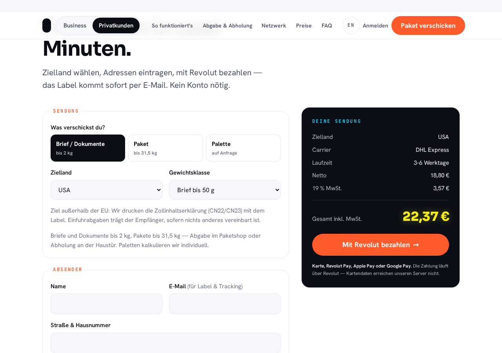

**Startseite: Palettenanfrage im Checkout**

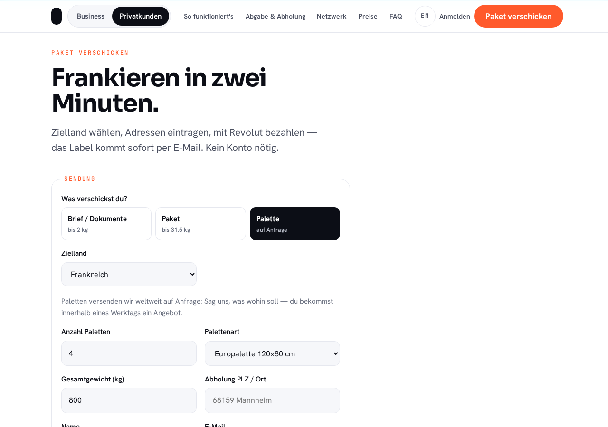

**Startseite: Preistabelle mit „ab“-Preisen je Kategorie**

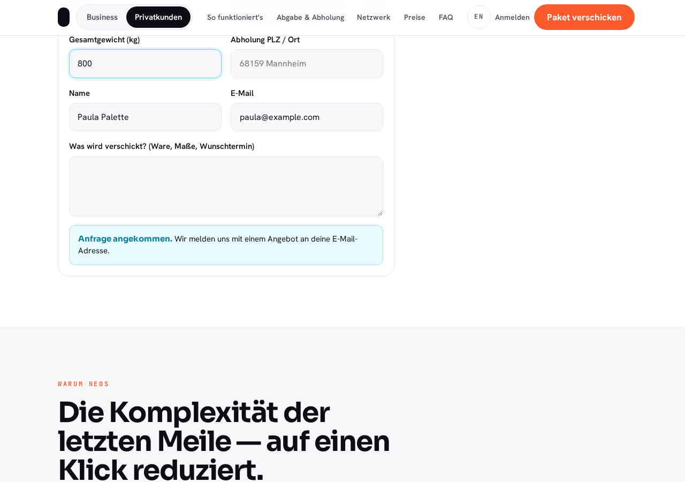

**Portal: Neue Sendung (Firma) mit Kategorie, Zollhinweis, Carrier-Vergleich und Summenkarte**

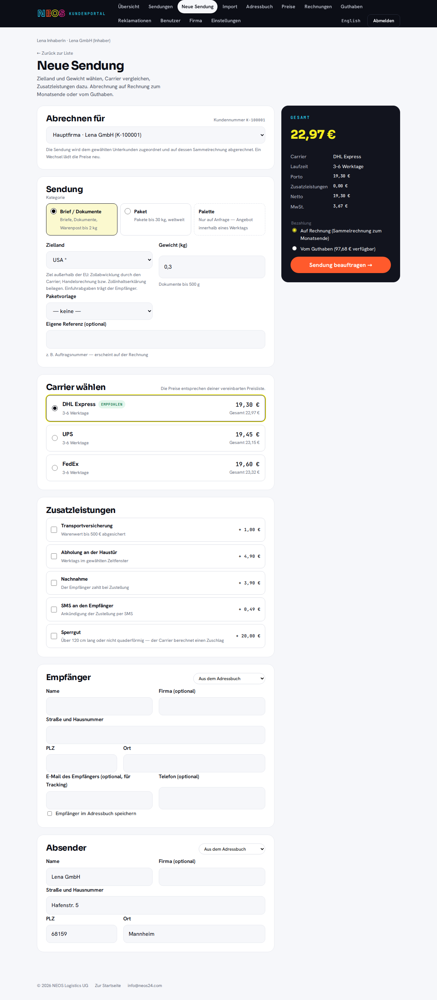

**Portal: Sendungsimport mit Vorschau**

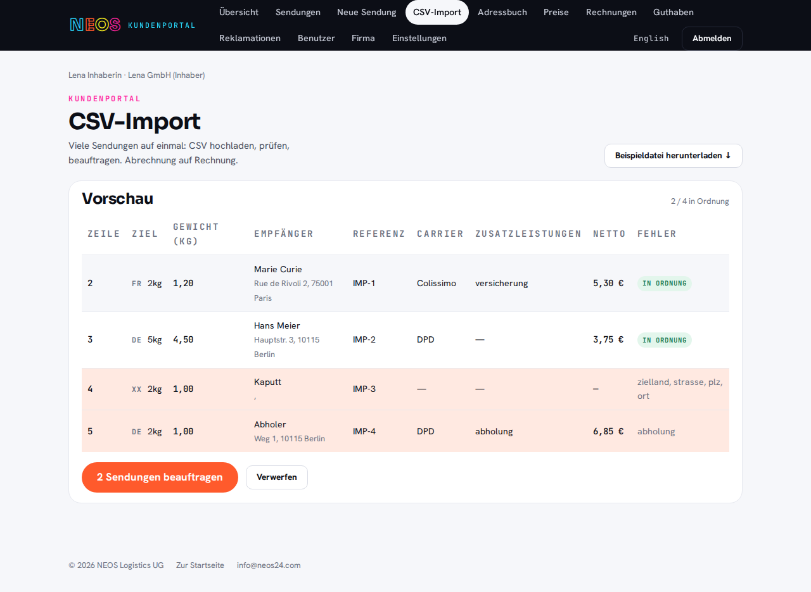

**Portal: Belegarchiv einer Firma**

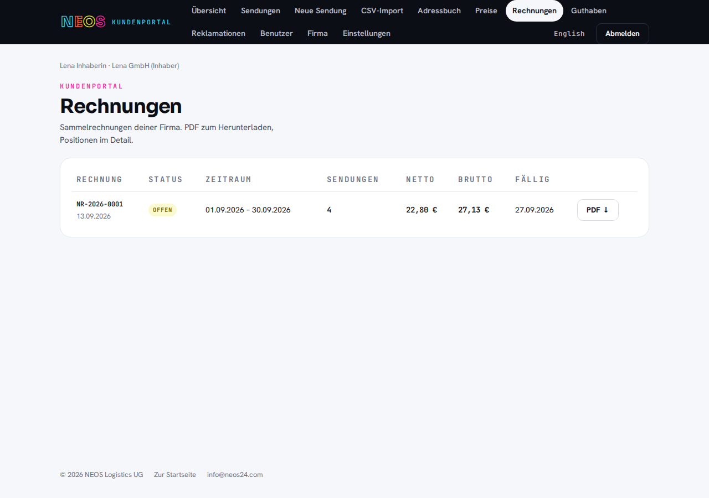

**Portal: Benutzergruppen mit Rechtematrix**

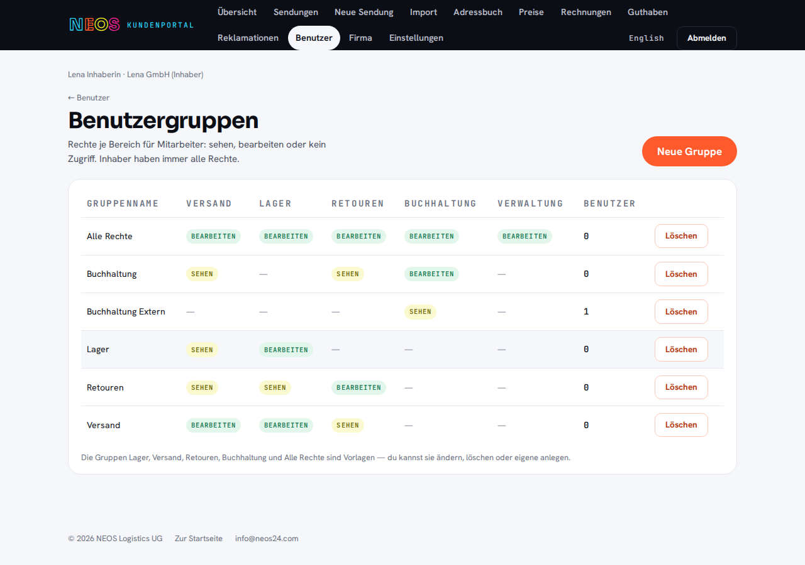

**Dashboard: Übersicht**

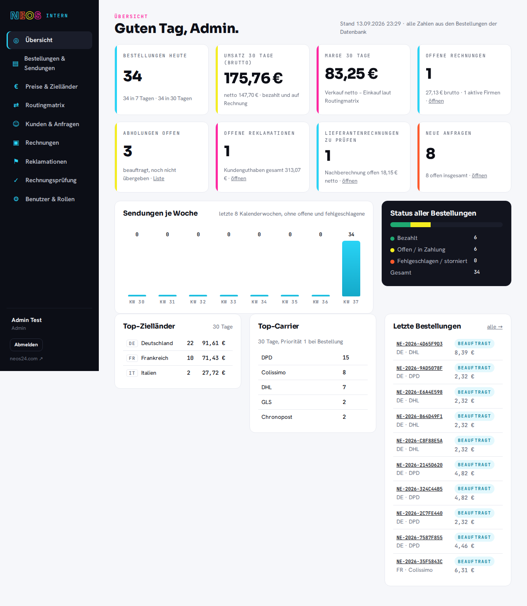

**Dashboard: Routingmatrix nach Kategorie**

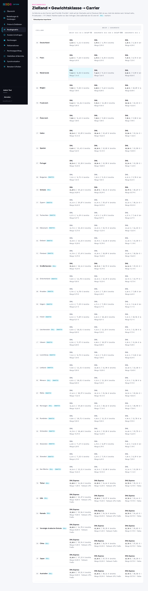

**Dashboard: Rechnungsprüfung einer echten Carrier-Rechnung**

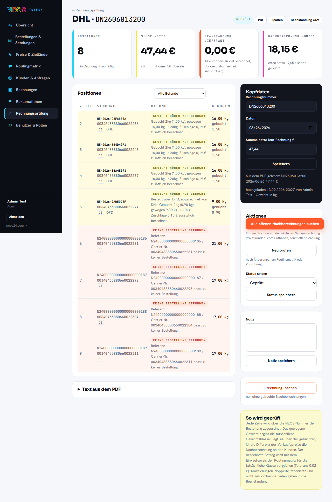

**Dashboard: Firma mit Unterkunden, Benutzern und Gruppen**

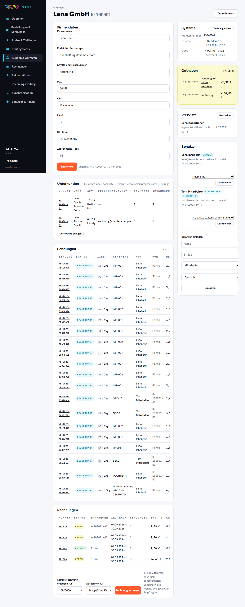

**Dashboard: Statistiken mit Vorperiodenvergleich**

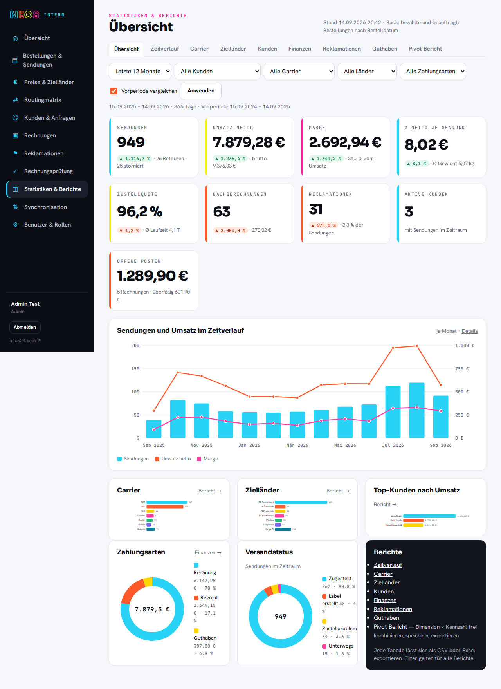

**Mobil: Portal-Sendungsformular bei 375 px**

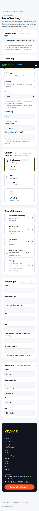
